# 形式语言与自动机

## 第一讲：绪论&数学基础

#### 〇. 课程基本信息

1. 教材信息：` Introduction to Automata TheoryLanguages, and Computation`
2. 进度安排
   + 课程概况及预备知识 3 学时
   + 有限状态自动机，正则语言，正则表达式
     第 2，3，4 章，约 15 学时
   + 上下文无关文法，上下文无关语言，下推自动机
     第 5，6，7 章，约 15 学时
   + 图灵机，计算问题分类
     第 8 章，约 6 学时，第 9，10，11 章，约 6 学时，机动 3 学时
3. 考核方式
   + 课堂表现 **5%** `雨课堂大题`
   + 课堂小作业  **20%** `共14次，期限为一周后23.59` `每迟交一天，分数折扣-10，至多-60`
   + 编程大作业  **15%**  `共三次，DDL3-4周，个人独立完成，有良好的编码习惯，严禁抄袭`
   + 期末考评   **60%**

4. 课程内容概要

   + **正则语言**：DFA、NFA、关系优化、正则表示、正则文法、语言的性质

   + **上下文无关语言**：PDA、DPDA、关系、上下文无关文法、文法规范

   + **递归可枚举语言**：Turing、图灵机扩展、图灵计算、递归语言、判定性问题、算法的复杂性

#### 一. 数学基础

##### 1. 幂集合、关系、半群的概念

+ 幂集合：S的幂集是S所有子集的集合

  例如：S={a,b,c} 则S的幂集为$2^S$={$\emptyset$,{a},{b},{c},{a,b},{a,c},{b,c},{a,b,c}}

+ 笛卡尔积：A×B是有序数对

  `例如：A = { 2, 4 } ， B = { 2, 3, 5 }`

  `A X B = { (2, 2), (2, 3), (2, 5), ( 4, 2), (4, 3), (4, 5) }`

+ 关系：``R⊂A×B `， A和B的笛卡尔积的任何子集都叫做A和B的一个关系

+ 等价关系

  要求：自反、传递、对称

  等价类：对集合A上等价关系R, 定义元素 x 的等价类：[x]~R~ = {y | x R y }

+ 半群

  半群是一个数学概念，它是一个集合，其上定义了一个**封闭**的二元运算，这个运算满足**结合律**。【重点就是**封闭且结合律**】
  封闭：即对于集合中的任意两个元素进行这个运算后，结果仍然属于该集合
  结合律：即运算的顺序不影响最终结果
  具体地说，一个半群可以用符号表示为(**S\***\)其中S是集合，\*是定义在S上的二元运算。

##### 2. 同构与同态

+ 同构映射：
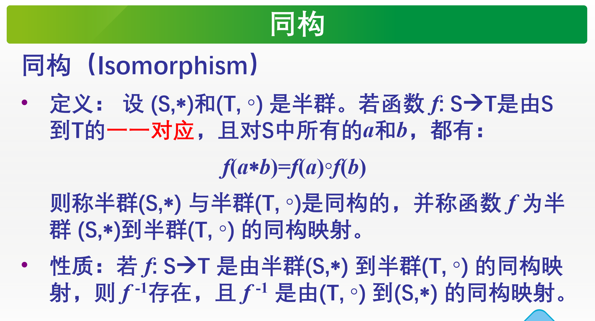
  - 定义：
    若存在一个从半群(S, ∗)到半群(T, ◦)的**一一对应**函数f ： S→T，且满足一定条件，那么我们称半群(S, ∗)与半群(T, ◦)是同构的。
    这个函数f被称为半群(S, ∗)到半群(T, ◦)的同构映射。
  - 同构条件：
    条件是对于S中的任意元素a和b，函数f满足**f(a∗b) = f(a) ◦ f(b)**。
    换句话说，同构映射保持了半群之间的运算结构，即两个半群上的运算在同构映射下保持一致。

  - 证明同构的步骤：
    - Step 1 定义一个函数 f: S→T, 使得 Dom(f)=S;
    - Step 2 证明 f 是单射；
    - Step 3 证明 f 是满射；
    - Step 4 证明 f(a∗b)=f(a)◦f(b)

+ 同态映射：
  + 定义：
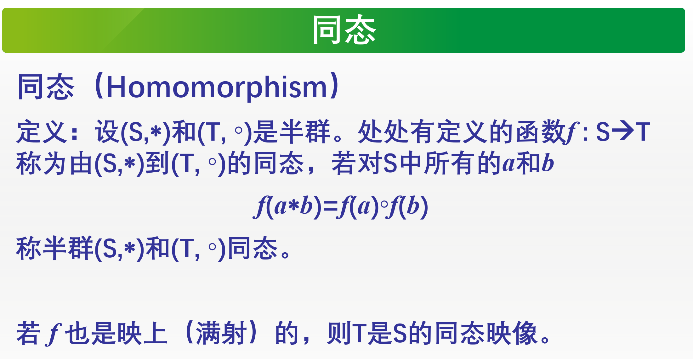
    给定两个半群(S, ∗)和(T, ◦)，一个函数f：S→T被称为从半群(S, ∗)到半群(T, ◦)的同态映射。
    同态映射的定义要求对于S中的**所有**元素a和b，满足**f(a∗b) = f(a) ◦ f(b)**。
    换句话说，同态映射保持了半群上的运算结构，即在映射下，两个半群中的元素进行运算后，结果的映射等于各自元素的映射再进行相应的运算。

  + 同态映像
    如果同态映射f是**满射**的（即映射到T上的每一个元素都有对应的原像），则称T是S的同态映像。
    【**同态不要求满射单射**，同态映像要求了**满射**】

##### 3. 群：

在一个半群S中，若满足以下两个条件，则称S为一个群：
+ 存在一个元素𝑒 ∈ S，对于S中的任意元素a，都有𝑒 ∗ a = a ∗ 𝑒 = a 这个元素𝑒被称为单位元或幺元。
+ 对于S中的任意元素a，存在一个元素b ∈ S，使得a ∗ b = b ∗ a = 𝑒 这个元素b被称为a的逆元，记作a⁻¹。
+ 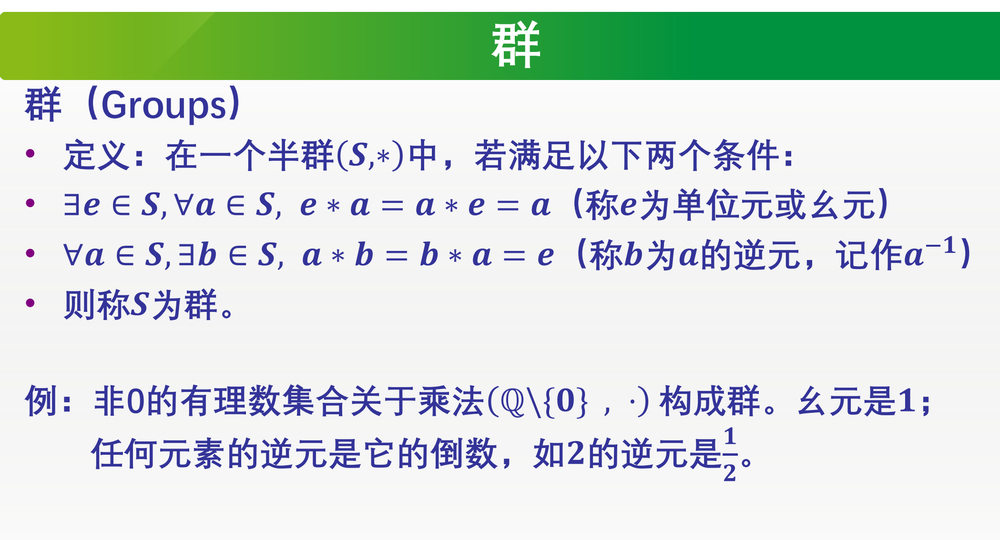

#### 二. 图

+ 有向图：G=<V,E>   节点V，边E，边是顶点集合上的一个关系
+ 标记图
+ 通路：相邻的边尾首连接的序列
+ 路径：没有重复边的通路
+ 简单路径：没有重复顶点的路径
+ 回路：从某顶点到自身的一条通路
+ 简单回路：只有开始顶点重复的回路
+ 树：根节点、父节点、子节点、叶节点，树里面没有环，树的高度为总层数-1

#### 三. 证明方法

+ 演绎证明
  演绎法：前提→结论
  证明方法1：If-Then  If 部分作为已知的命题，Then部分作为结论.
  证明方法2：If-and-only-if （当且仅当）

+ 数学归纳法

  + 形式1：数学归纳法是从有限到有限或无限的证明方法，包括归纳基础、归纳假设、归纳推导三个步骤。
  + 形式2：证明对任意自然数n，P(n)成立，证明P(0)成立，对于k<n，P(k)成立，证明P(n)成立。
  + 形式3（互归纳法）：证明一个新的性质H(n)，它等价于P1(n)与P2(n)，…，Pm(n)的合取，并且证明H(n)比证明P1(n)更容易，那么通过证明H(n)，我们也就证明了性质P1(n)。
  + 形式4（结构归纳法）：
    由归纳定义的具有结构 f 的集合 S, 欲证: 对∀x∈S, 满足性质 P(x).
    基础：证明存在 a ∈ S，满足性质 P(a)
    归纳：若 a1, a2, …, an ∈ S, P(a1), P(a2), …, P(an), 证明 f (a1, a2, …, an) ∈ S, P(f (a1, a2, …, an))

+ 反证法
  原命题与逆否命题等价。
  欲证 若 A, 则 B, 可证明如下命题：若 非 B, 则 非 A

#### 四. 形式语言基础

+ 字母表：一些表示字母的集合
+ 字符串：例如：$\Sigma=\{a,b\}$，字符串可以有`a` `ab` `abab` `aaaaabbbbbbaaba`
+ 字符串的运算：连接$wv$    反转$w^R$
+ 空串：空串$\varepsilon$是不含任何字符的串，$|\varepsilon|=0$，空串是**连接运算**的单位元
+ 子串：字符串中部分连续字符构成的字符串    前缀+后缀（一一对应）
+ 字符串的幂运算：$w^0=\varepsilon$
+ 字母表的\*闭包运算：字母表中所有有限字符构成串的集合
  例：$\Sigma=\{a,b\}$   $\Sigma^*=\{\varepsilon,a,b,aa,ab,ba,bb,aaa,bbb,……\}$
+ 字母表的+闭包运算：$\Sigma^*$中去除空串的集合
  例：$\Sigma=\{a,b\}$   $\Sigma^+=\{a,b,aa,ab,ba,bb,aaa,bbb,……\}$

#### 五. 语言运算

+ 形式语言：是用精确的数学或机器可处理的公式定义的语言

  而形式语言理论学科中所研究的形式语言，则是一个字母表上的某些有限长字符串的集合。一个形式语言可以包含无限多个字符串。

+ 语言：当字母表为$\Sigma$，$L\subseteq\Sigma^*$成为$\Sigma$上的一个语言
+ 空集与空串：空集是一个语言，空串是语言的一个元素
+ 语言的运算：集合运算、补运算、语言的反转、语言的链接
+ 语言的幂 $L^n=LL……LL$
  例：$\{a,b\}^3={aaa,aab,aba,abb,baa,bab,bba,bbb}$
  例：$L=\{a^nb^n | n\ge 0\}$ 则$L^2=\{a^nb^na^mb^m|n,m\ge0\}$ 有$aaabbaaabbb\in L^2$
+ 语言的\*闭包：$L^*=L^0\cup L^1\cup L^2\cup…$
+ 语言的+闭包：$L^+=L^*-\{\varepsilon\}$
+ 自然语言：所有合法句子所构成的集合

---
## 第二讲：确定有限自动机

#### 一. 确定有限自动机的概念

1. 有限自动机：输入字符串—输出`Accept`或`Reject`
2. 状态转移图的构成：1个初始状态 + 输入 + 转移 + 状态（非终态）`reject` + 终态`accept` $0 \sim n$个
   状态转移图中：一个圈表示reject,两个表示accept。不同的圈用于区分。

#### 二. 确定有限自动机的定义

1. 确定有限自动机$DFA(deterministic\; finite\; automata)$是五元组 $A=(Q,\Sigma,\delta,q_0,F)$。

   + $Q$ ：有限状态集
   + $\Sigma$：输入符号集（输入字母表）
   + $\delta$：  转移函数
   + $q_0$： 开始状态
   + $F$：  终态集合

2. 相关公式和关系：
   $$
   q_0 \in Q\quad F \subseteq Q\quad \delta : Q \times \Sigma \to Q
   $$
3. 转移函数表：列了个表，表述了每个状态在不同的输入再去往哪一个状态。并且第一列中，如果加上$\rightarrow$则是初态，如果加上$*$则是终态`accept`。

#### 三. 扩展转移函数

1. 扩展转移函数：
   $$
   \delta^* : Q \times \Sigma^* \to Q
   $$
   表述案例：

   $$\begin{aligned}
   \delta^*(q_0,ab)&=&q_2\\
   \delta^*(q_0,aa)&=&q_5\\
   \delta^*(q_0,abba)&=&q_4
   \end{aligned}
   $$

2. 显然：存在一条从$q$到$q'$的且标记为$w$的路径
   $$
   \delta^*(q,w)=q~`\\w=\sigma_1\sigma_2\sigma_3~\cdot\cdot~\cdot\sigma_k
   $$

3. 递归的定义
   + 基础：$\delta^*(q,\varepsilon)=q$
   + 递归：$\delta^*(q,w\sigma)=\delta(\delta^*(q,w),\sigma)$

#### 四. 正则语言

1. $L(M)$的定义：设$DFA$为$M$，由$M$接受的所有字符串构成的集合称为$M$的语言，记为$L(M)$，即：

   ​					==$L(M)=\{M中从初态到终态的串\}$==

2. 正则语言：$DFA$接受的语言称为正则语言，即：

   ​				==$正则语言构成的集合=\{L(M)|M是DFA\}$==

3. 对于$DFA:M=(Q,\Sigma,\delta,q_0,F)$
   + $M$接受的语言为：$L(M)=\{w\in\Sigma^*|~\delta^*(q_0,w)\in F\}$
   + $M$不接受的语言：$\overline{L(M)}=\{w\in\Sigma^*|~\delta^*(q_0,w)\notin F\}$

#### 五. DFA的构造

---

## 第三讲：非确定有限自动机 

#### 一. 非确定有限自动机的概念

+ NFA存在的一些特殊行为
  + $\Sigma=\{a\}$存在一个状态有两个变迁选择
  + 存在状态没有迁移（停机）

+ NFA接受
  + 字符串NFA路径接受
    NFA的一条路径中，字符串w输入完，且处于NFA的终态。
  + 字符串FNA接受
    NFA至少存在一条接受字符串w的路径

+ 字符串NFA拒绝
  + 字符串w被**一条路径**拒绝
    + 字符串输完但是不在终态
    + 字符串无法输完（脱机）
  + 字符串w被**NFA拒绝**
    NFA中没有一条路径可以接受字符串w
+ NFA的语言：NFA接受字符串的集合

#### 二. $\varepsilon$-转移

+ $\varepsilon$符号不出现在的带符号
+ （可以把它视为一个微小变量可以直接过去）

#### 三. 非确定有限自动机的定义

+ 非确定有限自动机是五元组$A=(Q,\Sigma,\delta,q_0,F)$
  + $Q$：有限状态集
  + $\Sigma$：输入符号集
  + $\delta$：转移函数
  + $q_0$：开始状态
  + $F$：终态集合
+ 与$DFA$不同：$\delta：Q\times\Sigma\cup\{\varepsilon\}\rightarrow2^Q$
+ $\varepsilon$-闭包
  + 状态$q$的$\varepsilon$-闭包是$q$（包括$q$自身）的$\varepsilon$路径到达的所有状态，记为$EC(q)$。
  + 递归定义：设$NFA~A=(Q,\Sigma,\delta,q_0,F),q\in Q,EC(q)$满足如下条件：
    + $q\in EC(q)$
    + 若$p\in EC(q)$且$r\in\delta(p,\varepsilon)$，则$r\in EC(q)$
  + 集合$S$的$\varepsilon$-闭包$EC(S)$定义为$EC(S)=\cup EC(q)$

#### 四. 扩展转移函数

+ $NFA$状态转移函数	$\delta:Q\times\Sigma\cup\{\varepsilon\}\rightarrow2^Q$
  + $\delta$扩展之一：	$\delta ^*:Q\times\Sigma ^*\rightarrow2^Q$
  + $\delta$扩展之二：	从$\varepsilon$-闭包，到$\varepsilon$-闭包
+  $\delta^*(q,\varepsilon) = EC(q)$的归纳
   $\forall x \in \Sigma^*, a \in \Sigma(\varepsilon \neq a),$
  ​	$\delta^*(q, xa) = EC \left( \bigcup_{p \in \delta^*(q, x)} \delta(p, a) \right)$
  说明: 对 $\delta^*(q, x)$ 中的每个状态，都可以从 $\delta$ 函数中一个状态跳转；将这些状态集合取并集后，对结果中的每一个元素求 $\varepsilon$-闭包，再将结果一起。

#### 五. 等价性证明

 (Z-Library).pdf#page=66&rect=63,438,401,454)

+ 自动机$M_1$和自动机$M_2$成为等价，如果两自动机接受的语言相同，即$L(M_1)=L(M_2)$
+ $NFA$接受的语言=正则语言
+ $NFA$转换$DFA$的算法：**子集构造法**
  + 若$NFA$的初始状态是$q_0$。则$DFA$的初始状态是$[EC(q_0)]$
  + 对DFA中的部分状态$q_i, q_j, ..., q_m$
    如果定义NFA中存在如下迁移： $\bigcup\delta^*(q_i, a),  \delta^*(q_j, a), \dots$ = $\{q_i', q_j', ..., q_m'\}$
    则在DFA中添加相应移动： $$\delta([q_i q_j ... q_m], a) = \[q_i' q_j' ... q_m'\]$$
  + $DFA$接受状态：若状态$q_j$是$NFA$中的终态，则$DFA$中的状态$[q_iq_j\dots q_m]$是$DFA$中的终态。
+ 定理：对于$NFA ~M$，通过上述构造过程得到的$DFA~M\prime$。同时，DFA可以视为NFA的特例于是有，即：$L(M)=L(M^\prime)$

---

## 第四讲：正则语言与正则表示

#### 一. 单一终结状态的NFA
+ 任何一个NFA都可以等价于只有一个终态的NFA，构造方法为：新建一个终态$q_f$，并将原来的所有终态都指向$q_f$（$\varepsilon$转移），并且将原来的终态都变为非终态。

#### 二. 正则语言的运算性质

+ 正则语言对于以下运算封闭
  + 并：$L_1\cup L_2$
    $L_1\cup L_2=\{a^nb|n\ge0\}\cup\{ba\}$
  + 连接：$L_1L_2$
    $L_1L_2=\{a^nb|n\ge0\}\{ba\}=\{a^nbba|n\ge0\}$
  + 星运算：$L_1^*$
    表示一个状态集合的任意次重复，包括零次。
  + 反转：$L_1^R$
    反转所有的迁移，将初态变为终态，反之亦然
  + 补：$\overline {L_1}$
    $\overline {L_1}=\{a,b\}^*-\{a^nb\}$
  + 交：$L_1 \cap L_2$

上面的性质可以用构造能接受上面语言的NFA证明。
对于语言的反转，先转换为只有一个终态的NFA，然后将所有的迁移反转，初态终态调换。
对于语言的补运算，设计接受语言的DFA，然后将所有的终态修改为非终态，非终态修改为终态。

- 空集是正则语言
- 在NFA中删除除初态外的一部分，得到的自动机表达能力一定更弱
#### 三. 正则表示和语言

+ 正则表示也可以表示语言。如：$(a+b\cdot c)^*$
  描述了如下的语言
  $\{a,bc\}^*=\{\varepsilon,a,bc,aa,abc,bca,\cdots\}$
+ 递归定义：
  + 基础：$\varnothing,\varepsilon,a$
  + 规则：给定两个正则表示$r_1,r_2$，$r_1+r_2,r_1\cdot r_2,r_1^*,(r_1)$都是正则表示

+ 正则表示运算符的优先级：
  + \*（星闭包）
  + $\cdot$（连接）
  + $+$（并）

+ 正则表示的语言：正则表示$r$的语言记为 $L(r)$

​	对于基本的正则表示：特别注意
$$
\begin{aligned}
L(\varnothing)&=\emptyset\\
L(\varepsilon)&=\{\varepsilon\}\\
L(a)&=\{a\}
\end{aligned}
$$
由上面的基本表示能递归定义正则表示式。

+ 等价正则表示：对于正则表示$r_1、r_2$，如果有$L(r_1)=L(r_2)$，则称$r_1$和$r_2$是等价的，记为：$r_1=r_2$

#### 四. 正则表示和正则语言[[]]

+ 定理：正则表示的语言是正则语言
	+ 一方面：由正则表达式的定义过程和正则语言的性质可以证明
	+ 另一方面： (Z-Library).pdf#page=74&rect=60,371,447,389)
 (Z-Library).pdf#page=77&rect=5,238,455,256)
+ 状态消去法 ^af9761
  + 思想：设正则语言对应$NFA~~ M$
    + 扩展自动机*M*，将正则表示作为转移的输入.
    + 消去某一中间状态：
      + 与其相关的转移弧同时消去；
      + 通过修改每一个前趋状态及后继状态的转移弧标记，弥补消去的转移弧

  + 步骤：
    1. 对**每一终态**$q$，依次消去除$q$和初态$q_0$之外的其它状态:
    2. 若$q \neq q_0$，得到对应的正则表示为$R^*T(U+SR^*T)^*$或$(R+TU^*S)^*TU^*$
    3. 若$q = q_0$，得到对应的正则表示为$R^*$
    4. 最终的正则表示为每一终态对应的正则表示之和（并）.

+ 路径迭代法，类似于图中的$Warshall$算法
  + 思想：设正则语言对应的$DFA ~~A$
    + 将$A$的状态集用$\{1,2,\cdots,n\}$表示，且初态为1
    + $R_{ij}^{(k)}$为表示如下语言的正则表示：
      $w\in L(R_{ij}^{(k)})$  if  从$i$到$j$有一条标记为$w$的路径，且这条路径除了$i、j$之外，所有其他状态的编号不大于$k$。
      对所有的$i、j、k=1,2,\cdots，n$迭代计算$R_{ij}^{(k)}$：
      ​	$R_{ij}^{(k)}=R_{ij}^{(k-1)}+R_{ik}^{(k-1)}(R_{kk}^{(k-1)})^*R_{kj}^{(k-1)}$

    + 通过(2)的迭代过程最终可以计算出$R_{ij}^{(n)}，(i,j=1,2,3,\cdots,n)$
    + 将所有的$R_{1j}^{(n)}$相"+"（$j$为任一终态）

#### 五. 正则语言的同态

+ 同态$(homomorphism)$的定义
  设映射：$h:\Sigma \rightarrow T^*$，对$w=a_1a_2\cdots a_n\in\Sigma^*$，定义$h(w)=h(a_1)h(a_2)\cdots h(a_n)$，则映射$h$为$\Sigma$一个同态。
+ 对语言$L\subseteq\Sigma^*$，定义$L$的同态$h(L)=\{h(w)~|~w\in L\}$
+ 同态的作用为将语言放在较小的字母表上进行操作

+ 定理：若$L$为正则语言，$h:\Sigma \rightarrow T^*$，**则$h(L)$也是正则语言**。
+ 对$E$的结构进行归纳
	+ 基础：为$E$为$\varepsilon$，$\varnothing$，有$h(E)=E$，则为正则表示，且显然$L(h(E))=h(L(E))$；
	  若$E$为$a$，有$h(E)=h(a)$，则为正则表示，且$L(h(E))=h(L(E))=\{h(a)\}$；
	+ 归纳：对$E=E_1E_2,h(E_1),h(E_2)$为正则表示，且$L(h(E_1))=h(L(E_1))、L(h(E_2))=h(L(E_2))$；
	  由定义：$h(E)=h(E_1)h(E_2)$；
	  $h(E)$为正则表示，且：$L(h(E))=h(L(E))$
	+ 归纳：类似证明$E=E_1+E_2$和$E=E_1^*$

+ 正则语言的逆同态
  + 设同态映射$h:\Sigma \rightarrow T^*$，对语言$L\subseteq T^*$，定义$L$的逆同态：$h^{-1}(L)=\{w~|~w\in \Sigma^* \land~ h(w)\in L\}$
+ 定理：若$L\subseteq T^*$为正则语言，$h:\Sigma\rightarrow T^*$为同态映射，则$h^{-1}(L)$也是正则语言。

#### 六. 正则表示的代数定律

注意下面的$\varepsilon$指的是$\{\varepsilon\}$
设$L、M、N$均为正则表示
+ 交换律与结合律
  $$
  \begin{aligned}
  &L+M=M+L\\
  &(L+M)+N=L+(M+N)\\
  &(LM)N=L(MN)
  \end{aligned}
  $$
+ 单位元和零元
	+ 对于并运算，单位元是$\emptyset$
	+ 对于连接运算，单位元是$\{\varepsilon\}$，零元是$\emptyset$
  $$
  \begin{aligned}
    &\varnothing + L = L+\varnothing = L\\
  &\varepsilon L=L\varepsilon=L\\
  &\varnothing L=L\varnothing=\varnothing
  \end{aligned}
  $$
+ 分配律
  $$
  \begin{aligned}
  &L(M+N)=LM+LN\\
  &(M+N)L=ML+NL
  \end{aligned}
  $$
+ 等幂律
  $$
  L+L=L
  $$
+ 闭包相关的定律
  $$
  \begin{aligned}
  &(L^*)^*=L^*\\
  &\varnothing ^*=\varepsilon\\
  &\varepsilon ^*=\varepsilon\\
  &L^+=LL^*=L^*L\\
  &L^*=L^++\varepsilon\\
  &L?=\varepsilon+L
  \end{aligned}
  $$
---

## 第五讲：正则文法与正则语言 

#### 一. 文法

+ 文法的定义 $G=(V,T,S,P)$
  $V$：变量的集合
  $T$：终结符的集合
  $S$：开始变量
  $P$：产生式的集合

+ 示例：
  $$
  \begin{aligned}
  &S\rightarrow aSb\\
  &S\rightarrow \varepsilon\\
  &G=(V,T,S,P):V=\{S\};T=\{a,b\};P=\{S\rightarrow aSb,S\rightarrow \varepsilon\}
  \end{aligned}
  $$

- 由变量和终结符构成的字符串称为句型
- 由终结符构成的字符串称为句子

- 推导和推导闭包
	+ 推导：$G$从变量$A$推导出句子$\alpha$，记为$A\Rightarrow\alpha$
	+ 推导闭包：$G$从变量$A$推导出句子$\alpha$，记为$A\Rightarrow^*\alpha$，但是不关心推导的具体过程

文法的语言为：$L(G) = \{w| S\Rightarrow^* w , w\in T^*\}$
如果两个文法对应的语言相同，那么认为两个文法等价。
#### 二. 线性文法

+ 线性文法的定义：产生式**右侧至多有一个变量**
+ 右线性文法$G$：所有产生式只有两类$A\rightarrow xB$或$A\rightarrow x$
+ 左线性文法$G$：所有产生式只有两类$A\rightarrow Bx$或$A\rightarrow x$
+ 右线性文法和左线性文法统称为**正则文法**
+ **线性文法的表达能力严格强于正则文法**，但是弱于CFG
#### 三. 正则文法和正则语言

+ 定理：正则文法产生的语言=正则语言
	+ 对于正则文法，可以构造对应的NFA接受文法对应的语言
	+ 将NFA转变为等价的右线性文法
#### 四. 自动机的积
+ 定义：
  给定DFA
  $$
  A=(Q_A,\Sigma,\delta_A,q_{0A}.F_A)\\
  ~~B=(Q_B,\Sigma,\delta_B,q_{0B}.F_B)
  $$
​	则称自动机$M=(Q_A\times Q_B,\Sigma,\delta,(q_{0A},q_{0B}),F_A\times F_B$为$A$和$B$的积，或称$M$为积自动机。
其中状态转移函数为$\delta((q_A,q_B),a) = (\delta_A(q_A,a), \delta_B (q_B,a))$
​	记为$M=A\times B$
+ 积自动机接受的语言是前两DFA的**交**。
---

## 第六讲：正则语言的判定性质&DFA的优化

#### 一. 基本问题

+ 判定算法（以DFA表示正则语言）
	+ 从初态开始，输入字符串 *w* ，若可以到达某一终态，则该正则语言中接收 *w*，否则不接收 *w* 。
	  + 算法复杂度：设输入字符串*w* 的长度 |*w* |=n，上述判定算法的复杂度为 $O(n)$。

+ 判定算法（以NFA表示正则语言）
	+ 可将其转化为等价的 DFA，然后执行上述过程；也可直接模拟处理字符串*w*的过程。
	  +  判定算法的复杂度为$O(ns^2)$， 其中n为*w* 的长度，s为NFA 的状态数目。对于目前可达的$\varepsilon-$闭包，接受输入后遍历可达的$\varepsilon$闭包，复杂度为$O(n(s+|\delta|))$，在最坏情况下，可能达到上面的时间复杂度。

+ 判定算法（正则语言为空）
	+ 给定一正则语言L（给定一个DFA、NFA、正则表示式），怎样判断L是否为空, $L=\varnothing$
	+ 方法：去接受语言L的DFA M，判断M是否有从初态到终态的路径
	+ 设有限自动机的状态数目为 n，上述判定算法的复杂度为$O(n^2)$（自动机）/$O(n)$（正则表示式）。

+ 判定正则语言相等
  + 给出两个正则语言$L_1$和$L_2$，判定$L_1=L_2$
  + 算法思想：将两个正则语言转化为DFA，证明DFA是否等价
    + 适当重命名，使得两个DFA没有重名的状态
    + 将两个DFA相并，构造新的DFA M
    + 对M用运用填表算法，证明原两个初态是否不可区别
  + 算法复杂度：上述算法的复杂度上限为$O(n^4)$，适当设计填表算法的数据结构可以使得复杂度降为$O(n^2)$

- 给定正则语言，判断$L$，判断$L$是否无限
	- 取接受语言的DFA，判断初态和终态之间是否有环路

#### 二. 泵引理

+ 泵引理（正则语言的必要条件）
  给出一无限正则语言$L$，存在一正整数m。
  对$\forall w\in L,|w|\ge m,\exists x、y、z,w=xyz$，满足：
  $|xy|\le m$且$|y|\ge 1$
  有：$w_i=xy^iz\in L,i=0,1,2,\cdots$

#### 三. 非正则语言的判定

*Pumping*引理可以表示为
$$\exists m \forall w \exists x \exists y \exists z \forall k (w \in L \land |w| \geq m \rightarrow w = xyz \land y \neq \epsilon \land |xy| \leq m \land (k \geq 0 \rightarrow xy^k z \in L))$$
命题的否定形式为：
$$\forall m \exists w \forall x \forall y \forall z \exists k (w \in L \land |w| \geq m \land w = xyz \land y \neq \epsilon \land |xy| \leq m \land (k \geq 0 \land xy^k z \notin L))$$

+ 泵引理的证明步骤
  1. 选任意的m
  2. 找到一个长度至少为m的串$w\in L$ （存在）
  3. 选满足$w=xyz\wedge y \ne \varepsilon \wedge |xy|\le m$的$x,y,z$ （对于任意的一种划分）
  4. 找到一个$k\ge 0$，使$xy^kz\notin L$

+ Pumping引理不是正则语言的充分条件

- **有限语言一定是正则语言**，一定可以构造一个NFA来接受这个语言。
#### 四. DFA的优化

+ 集合上的等价关系和集合的划分
  + 设 *R* 是集合*Q* 上的一个等价关系，由 *R* 产生的所有等价类（或块）的集合构成 *Q* 的一个划分。
  + 等价类：对任何$a\in Q$, $a$ 所在的等价类用$[a]$表示，定义为$[a]=\{x|xRa\}$
  + 每一元素都属于唯一的等价类，即满足
    1. 对任何的$a,b\in Q$，或者$[a]=[b]$，或者$[a]\cap[b]=\varnothing$
    2. $\cup _{a\in Q}[a]=Q$

+ DFA状态集合上的一个等价关系
  + 设$DFA~D=(Q,\Sigma,\delta,q_0,F)$，定义$Q$上的二元关系$R$：
    对任何$p,q \in Q~~~,~~~pRq~~~~if~~~~w\in\Sigma^*~~,~~\delta^*(p,w)\in F\Leftrightarrow \delta^*(q,w)\in F$

+ 状态集划分的算法-填表法
  + 填表算法：基于如下递归地标记可区别的状态偶对的过程。
    + 基础：若p为终态，q为非终态，则p和q标记是可区别的
    + 归纳：设p和q已标记为可区别的，若状态r和s通过输入符号a可分别转移到p和q，即$\delta(r,a)=p,\delta(s,a)=q$，则r和s也标记为可区别的。

+ 最优的DFA（DFA优化的步骤）**填表法得到的是最优的DFA**
  1. 删除从初态不可到达的状态及与其相关的边, 设所得到的 *DFA*为 $A=(Q,\Sigma,\delta,q_0,F)$
  2. 使用填表算法找出所有等价的状态偶对；
  3. 根据 2 的结果计算当前状态集合的划分块，每一划分块中的状态相互之间等价，而不同划分块中的状态之间都是可区别的。包含状态 *q* 的划分块用 $[q]$ 表示

---

## 第八讲：有限自动机的扩展&上下无关文法

#### 有限自动机的拓展

Moore自动机和Mealy自动机都是确定性的，是DFA的拓展形式。
##### Moore自动机
Moore自动机是六元组：$M = (Q, \Sigma,\Lambda, \delta,G, q_0)$
- Q是状态集合
- $\Sigma$是输入字母表
- $\Lambda$是输出字母表
- $\delta: Q \times \Sigma \rightarrow Q$是状态转移函数
- $G: Q \rightarrow \Lambda$是输出函数
- $q_0 \in Q$是初始状态

非形式化的，Moore自动机就是在转移到新的状态后，会输出一个字符，并且输出仅依赖于状态。

##### Mealy自动机

Mealy自动机同时带有输出，但是输出由状态和输入字符同时决定，即在转移时输出。

形式化的，Mealy自动机为六元组$A = (Q, \Sigma,\Lambda, \delta,G, q_0)$
- Q是状态集合
- $\Sigma$是输入字母表
- $\Lambda$是输出字母表
- $\delta: Q \times \Sigma \rightarrow Q$是状态转移函数
- $G: Q\times \Sigma \rightarrow  \Lambda$是输出函数
- $q_0 \in Q$是初始状态

#### 自动机的计算复杂性

- DFA和输入串
	- 空间复杂性为$O(1)$
	- 时间复杂度为$O(|w|)$
- NFA和输入串
	1. 非回溯法（Non-backtracking method）: 
		-  时间复杂度: $O(Q^2 \cdot w)$ 
		- 空间复杂度: $O(Q^2)$
	2. 回溯法（Backtracking method）: 
	- 时间复杂度: $O(Q \cdot w)$
	- 空间复杂度: $O(Q \cdot w)$

#### CFG

CFG的推导与归约：
- 归约是将产生式的右边替换为产生式的左边
- 推导是将产生式的左边替换为产生式的右边

最左推导与最右推导：
- 最左推导是从最左边的变量开始进行推导
- 最右推导是从最右边的变量开始进行推导

#### 语法分析树

注意在语法分析树的叶结点上可以是终结符也可以是变量，，将每个叶结点按照从左到右的次序连接起来得到一个$(V\cup T)^*$的字符串成为语法分析树的产物。

#### CFL

#### 三. 文法二义性

+ 二义文法概念：$CFG~~G= (V,T, S, P)$ 称为二义的，如果对某个$w ∈T^*$,存在根结点都为开始符号$S$ 的两棵不同的分析树（等价的，也可以是两种最左或者最右推导）, 其产物都是$w$。**注意二义性仅是对于文法而言的**

  $CFG~~G$, 如果对**每一**$w∈T^*$,仅存在一棵这样的分析树，则*G* 为无二义的文法。

+ 定理：对$CFG~~G= (V,T, S, P)$ 和$w ∈T^*$，$w$ 具有两棵不同的分析树，当且仅当存在两个不同的从开始从$S$到$w$的最左推导。

+ 文法二义性的的另一种定义：$CFG~~G= (V,T, S, P)$ 称为二义的，如果存在某个$w∈T^*$, 有两个不同的从开始符号$S$到$w$的最左推导。`用途：方便证明文法的无二义性。`
+ 二义性的判定：一个$CFG$是否为**二义的问题是不可判定的**，即不存在解决该问题的算法。

**注意：对于语言而言，语言是一组字符串的集合，是不存在二义性的。只是采用文法来描述这个语言的时候，某些文法会有二义性，有些则没有。**
#### 四. 二义性的消去方法

^51bdb0

+ 没有通用方法消去文法的二义性。（多尝试！）

+ 如果上下文无关**语言**$L$的**所有文法**都是二义的，则称$L$是固有二义的。（某些上下文无关语言只有二义文法）**注意这里说的是语言是固有二义的**

  例：$L=\{a^nb^nc^m\}\cup\{a^nb^mc^m\}$是固有二义的。

**注意：二义CFG表示的语言不一定是固有二义语言**

##### 算符优先级法&左结合法&最近嵌套法

+ 算符优先级：将文法的产生式按优先级进行排序，产生式的优先级越高，越靠前。**注意这里的靠前是在归约的意义下的，对于表达式的计算可以视为归约的过程**

	例：$E\rightarrow E+E|E*E|a$，其中$*$优先级高于$+$
	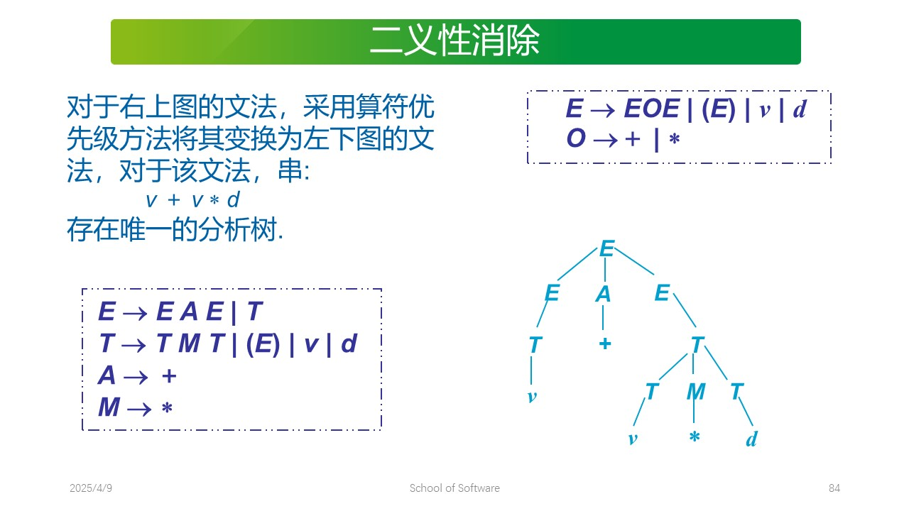

+ 左结合法：将文法的产生式按结合性进行排序，结合性越强，越靠前。和优先级方法类似的，将同级运算规定从左到右优先级逐渐减小。

	例：$E\rightarrow E+E|E*E|a$，其中$*$结合性强于$+$
	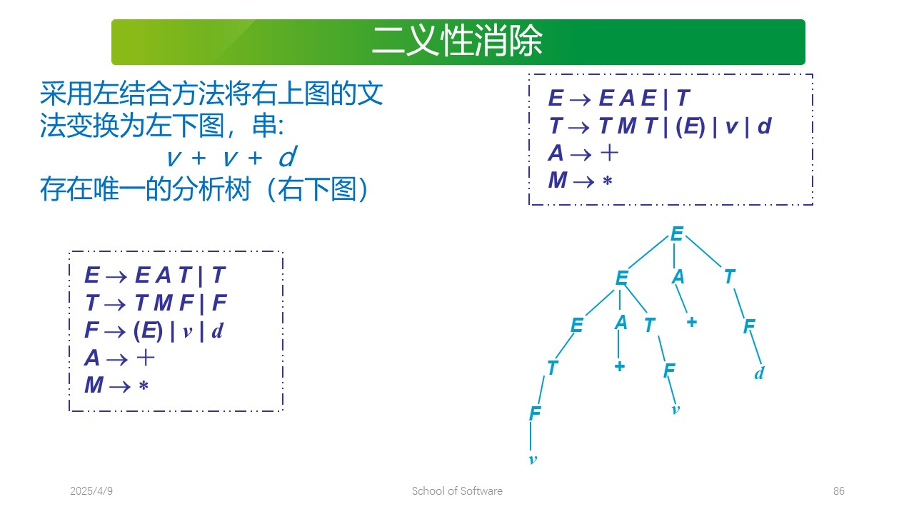

+ 最近嵌套法：将文法的产生式按嵌套程度进行排序，嵌套程度越深，越靠前。考虑$if$和$else$的匹配，在下面的例子中只有$M$能直接产生匹配的$if$和$else$。

	例：$E\rightarrow E+E|E*E|a$，其中$*$嵌套程度深于$+$
	
	
#### 五. CFG的构造方法

+ 例1：构造上下文无关文法G，接受L：$L=\{w=w^R|w\in\{0,1\}^*\}$
  ​	$S\rightarrow 0S0|1S1|0|1|\varepsilon$
+  例2：构造上下文无关文法G，接受L：$L=\{ww^R|w\in\{0,1\}^*\}$
	 $S\rightarrow 0S0|1S1|\varepsilon$
+ 例3：构造上下文无关文法G，接受L：$L=\{w\overline{w}^R|w\in\{0,1\}^*\}$
		$S\rightarrow 0S1|0S1|\varepsilon$
#### 六. CFG的构造实例

+ 流程：分析L特征，构造CFG的G，**再论证相互包含来证明等价**

- 例：构造0和1个数相等的语言

构造方法不仅有上面一种
- $S \rightarrow 0B|1A|\varepsilon, B\rightarrow 1S|0BB, A\rightarrow 0S|1AA$
- $S\rightarrow SS|0S1|1S0|\varepsilon$
	- 0和1个数相等的句子可拆分为若干个子区间，方法是是从开头向后依次统计0、1的个数，每当个数**第一次**相等区间断开一次。

例：构造满足0的数量是1的数量两倍的CFG
类似的，尝试构造：$S\rightarrow0S0S1S|0S1S0S|1S0S0S|\varepsilon$

---

## 第九讲：PDA

#### 一. PDA的介绍

+ PDA是NFA外加上栈组成
+ 状态转移：$q_1\rightarrow(a,b\rightarrow c)q_2$（其中a为输入符号，b为栈弹出符号，c为栈压入符号）
+ **栈为空时不允许进行迁移，停机！此时向栈中输入$\varepsilon$也是不允许的**
+ 分确定PDA：NPDA
+ 栈里面一个单元只能放入一个字符，一次只能**弹出一个字符**，可以一次压入多个字符
NPDA允许再相同的输入和栈顶符号时有多个状态转移，也允许$\varepsilon$转移
#### 二. PDA的定义

+ （终态型的）PDA为七元组：$P=(Q,\Sigma,\Gamma,\delta,q_0,Z_0,F)$
  有限状态集合、有限输入字母表、有限栈字符、转移函数、一个初始状态、一个栈初始符号、终态集合
+ 空栈型PDA为六元组：$P=(Q,\Sigma,\Gamma,\delta,q_0,Z_0)$

+ 约定：PDA即为NPDA，PDA即为终态型PDA
+ PDA接受串：**所有字符都被输入完毕&最后落在PDA的一个终态**（与栈内元素无关）
+ PDA拒接串：输入字符串不能读完or最后不能落在PDA的终态
+ 由于栈的特性，上述自动机在表达字符的个数、反转方面上有优势上述NPDA在构造时，使用这个结论
#### 三. PDA的即时描述

+ 即时描述（ID）定义：PDA的即时描述是一个三元组$(q,w,\gamma)$（当前状态、剩余输入串、栈中当前符号串）
+ 传递$\vdash$：设$PDA~~P=(Q,\Sigma,\Gamma,\delta,q_0,Z_0,F)$。
  $\vdash_P$或$\vdash$满足：
  若$(p,\alpha)\in \delta(q,a,X)$
  则$(q,aw,X\beta)\vdash(p,w,\alpha\beta)$
​	其中：$p,q\in Q,a\in\Sigma,w\in \Sigma^*,X\in \Gamma,\alpha\beta\in\Gamma ^*$
- **注意在在上面的表示中，从左到右为栈顶到栈底**

+ ID的传递闭包
  $\vdash_P^*$或$\vdash^*$定义为：
  基础：对于任意的ID $I$，都有$I\vdash^* I$
  归纳：如果$I\vdash K,K\vdash^*J$，则有$I\vdash^*J$

+ 定理：设$PDA~~P=(Q,\Sigma,\Gamma,\delta,q_0,Z_0,F)$，如果$(q,x,\alpha)\vdash^*(p,y,\beta)$那么对于任意的$w\in \Sigma^*~and~\gamma\in\Gamma^*$，$(q,xw,\alpha\gamma)\vdash^*(p,yw,\beta\gamma)$

#### 四. PDA的语言

+ 终态型PDA的语言
  设$NPDA~M=(Q,\Sigma,\Gamma,\delta,q_0,Z_0,F)$，则其语言$L(M)$定义为：
  $L(M)=\{w|w\in \Sigma^*,(q_0,w,z_0)\vdash^*_M(q_f,\varepsilon,u),u\in\Gamma^*\}$
+ 空栈型PDA的语言
  设$PDA~~P=(Q,\Sigma,\Gamma,\delta,q_0,Z_0)$，其语言$L(M)$定义为：
  $L(M)=\{w|(q_0,w,Z_0)\vdash^*(q,\varepsilon,\varepsilon),q\in Q\}$
+ 两种PDA语言的关系：**可以互相设计使得满足需求语言**，

#### 终态型 PDA → 空栈型 PDA 转换

1. 增加新初始状态 $q_s$，压入 $Z_0,Z'_0$。 添加新的栈底符号的意义是防止原PDA在某些非接受状态下被清空。 
2. 保留原机器所有转移。  
3. 从原终态 ε-跳到 $q_{\mathit{clear}}$。  
4. 在 $q_{\mathit{clear}}$ 用 ε-迁移弹出所有符号。  
5. 无终态，靠“栈空”判定接受。

给定终态接受 PDA  
$$
M = (Q,\Sigma,\Gamma,\delta,q_0,Z_0,F),
$$
等价地构造空栈接受 PDA  
$$
M' = (Q',\Sigma,\Gamma',\delta',q_s,Z'_0,\varnothing).
$$
##### 1. 构造要素
- **状态集**  
  $$
  Q' = Q \cup \{\,q_s,\;q_{\mathit{clear}}\,\}.
  $$  
  - $q_s$：新初始状态  
  - $q_{\mathit{clear}}$：清空栈状态

- **栈符号集**  
  $$
  \Gamma' = \Gamma \cup \{Z'_0\},
  $$  
  其中 $Z'_0$ 是新的栈底标记

- **初始状态与初始栈符号**  
  - 初始状态：$q_s$  
  - 初始栈符号：$Z'_0$

- **终态集**  
  $$
  F' = \varnothing
  $$  
  （统一使用空栈接受，无终态）

##### 2. 转移函数 $\delta'$

1. **进入原机器**  
   $$
   (q_s,\;\varepsilon,\;Z'_0)\;\mapsto\;(q_0,\;Z_0\,Z'_0)
   $$

2. **保留原机器的所有转移**  
   对每条  
   $$
   (p,\;a,\;A)\;\mapsto\;\{(p',\;\alpha)\}
   $$
   在 $\delta'$中照搬。

3. **终态到清空栈**  
   对每个 $f\in F$ 和任意 $X\in\Gamma'$：  
   $$
   (f,\;\varepsilon,\;X)\;\mapsto\;(q_{\mathit{clear}},\;X)
   $$

4. **清空栈状态循环弹出**
   对任意 $A\in\Gamma'$：  
   $$
   (q_{\mathit{clear}},\;\varepsilon,\;A)\;\mapsto\;(q_{\mathit{clear}},\;\varepsilon)
   $$

#### 空栈型PDA转换为终态型PDA

设给定空栈接受的PDA为：

$M = (Q, \Sigma, \Gamma, \delta, q_0, Z_0)$

我们构造一个终态型PDA：$M' = (Q', \Sigma, \Gamma', \delta', q_s, Z_0', F')$，其中：

- $Q' = Q \cup \{q_s, q_f\}$，其中 $q_s$ 是新初始状态，$q_f$ 是新终态；
- $\Gamma' = \Gamma \cup \{Z_0'\}$，$Z_0'$ 是新的栈底符号；
- 初始状态为 $q_s$，初始栈符号为 $Z_0'$；
- $F' = \{q_f\}$；
- 转移函数 $\delta'$ 包括以下部分：
  1. 初始过渡：$(q_s, \varepsilon, Z_0') \mapsto (q_0, Z_0Z_0')$，进入原机器并压入原始栈底；
  2. 保留原 $\delta$ 中所有转移；
  3. 添加空栈检测转移：对所有 $q \in Q$，添加 
$$
     \delta'(q, \varepsilon, Z_0') \ni (q_f, Z_0')
$$
表示当原机器栈清空至 $Z_0'$ 时跳转到终态 $q_f$。

**说明：**  
当 $M$ 接受某输入使得栈空，意味着 $M'$ 可以检测到栈回到 $Z_0'$ 并跳转到终态 $q_f$，从而完成终态接受。
#### 五. PDA与CFG

+ 定理：**上下文无关文法（CFG）语言=PDA接受的语言**
#### 空栈型PDA转换为CFG（上下文无关文法）

给定一个空栈接受的PDA  
$P = (Q, \Sigma, \Gamma, \delta, q_0, Z_0)$  
可转换为等价的CFG $G = (V, \Sigma, R, S)$，步骤如下：

##### 1. 非终结符集合 V
构造形如 $[p A q]$ 的非终结符，表示 PDA 从状态 $p$ 开始，以 $A$ 为栈顶符号，经过若干步骤清空 $A$，最终到达状态 $q$。

##### 2. 终结符集合
$\Sigma$（与PDA输入字母表相同）

##### 3. 开始符号 S
$S = [q_0 Z_0 q_f]$  **注意：上面的S产生式产生的应该是或！**
其中 $q_f$ 是某个能使栈清空的状态。

##### 4. 产生式规则 R

若 $\delta(p, a, A) \ni (r, B_1 B_2 \dots B_k)$，对所有状态序列 $s_1, \dots, s_k$，加规则：

$$
[p A s_k] \rightarrow a [r B_1 s_1] [s_1 B_2 s_2] \cdots [s_{k-1} B_k s_k]
$$

如果 $\delta(p, a, A) \ni (r, \varepsilon)$，则加规则：**注意添加的状态$s_1\dots$是任意状态，只要保证相等可以消去即可**

$$
[p A r] \rightarrow a
$$

**上面构造过程的最左推导就模拟了PDA的状态转移过程**。
##### 示例语言
$L = \{0^n1^n \mid n \geq 0\}$ 的PDA转换后的文法片段：

$$
S \rightarrow [q Z_0 q]
$$
$$
[q Z_0 q] \rightarrow 0 [q X q] [q Z_0 q] 1 \mid \varepsilon
$$
$$
[q X q] \rightarrow 0 [q X q] 1 \mid \varepsilon
$$

**注意：上面的S产生式产生的应该是或！**
#### 将上下文无关文法（CFG）转换为空栈型下推自动机（PDA）的方法

1. **定义PDA状态**：
   - 初始状态 $q_0$
   - 主要处理状态 $q_1$
   - 接受条件：输入读完且栈为空（无需显式接受状态）

2. **初始化栈**：
   - 添加转移：$\delta(q_0, \epsilon, \epsilon) = (q_1, S)$  
     （从 $q_0$ 不读输入，栈顶为空时压入 $S$ 并进入 $q_1$）

3. **处理产生式规则**：
   - 对每条产生式 $A \to \alpha$，添加转移：  
     $\delta(q_1, \epsilon, A) \ni (q_1, \alpha^{\text{R}})$  
     （在 $q_1$ 弹出 $A$，将 $\alpha$ 的逆序压栈，不消耗输入）

4. **处理终结符匹配**：
   - 对每个终结符 $a$，添加转移：  
     $\delta(q_1, a, a) \ni (q_1, \epsilon)$  
     （在 $q_1$ 读入 $a$ 并弹出栈顶的 $a$）

5. **示例：CFG $S \to aSb \mid \epsilon$ 的转换**：
   - 初始化：$\delta(q_0, \epsilon, \epsilon) = (q_1, S)$
   - 产生式规则：
     - $S \to aSb$：$\delta(q_1, \epsilon, S) \ni (q_1, aSb)$  
       （压入顺序为 $b \to S \to a$，栈顶为 $a$）
     - $S \to \epsilon$：$\delta(q_1, \epsilon, S) \ni (q_1, \epsilon)$
   - 终结符匹配：
     - $\delta(q_1, a, a) \ni (q_1, \epsilon)$
     - $\delta(q_1, b, b) \ni (q_1, \epsilon)$

**PDA接受条件**：输入字符串完全读完后栈为空。

---
## 第十讲：DPDA、CNF（确定下推自动机、CFG化简与规范）

#### 一. 确定下推自动机的概念

+ 定义：PDA $P=(Q,\Sigma,\Gamma,\delta,q_0,z_0,F)$称为确定的下推自动机（DPDA）,如果满足：

  + 对于$a\in\Sigma$或者$a=\varepsilon$，$X\in\Gamma-\{\varepsilon\},\delta(q,a,X)$最多包含一个元素。
	  + 在任何一个状态$q$，当你看到当前输入是$a$（可以是空串 $\varepsilon$），而栈顶是$X$的时候，**你只能有一个可选的操作**。并且**弹出的栈顶符号不能为空。**
	  + 当输入字符和栈顶字符不能全是$\varepsilon$，即$\varepsilon, \varepsilon \rightarrow \varepsilon$是不允许的
  + 对于$a\in\Sigma,a\neq \varepsilon$若$\delta(q,a,X)\ne \varnothing$，则$\delta(q,\varepsilon,X)=\varnothing$
	  + 如果你在当前状态$q$看到输入符号$a$，而栈顶是$X$时可以做某个操作，那就**不允许你“什么都不看输入”（$\varepsilon$）也做栈顶是$X$的操作**。
+ 状态不可以没有转移

  **说明该定义亦称为终态型DPDA，类似也可以定义空栈型DPDA**

+ 不容许迁移：
  $\delta(q_1,a,b)$和$\delta(q_1,\varepsilon,b)$不能同时出现。
  即可以存在单独的迁移$\delta(q_1,a,b)$和$\delta(q_1,\varepsilon,b)$，但是它们相互排斥，不能同时存在

+ DPDA语言

  （终态型DPDA语言）
  如果语言L能够被一DPDA $P=(Q,\Sigma,\Gamma,\delta,q_0,z_0,F)$​接收，则L称为确定性下推自动机的语言，或确定性上下文无关语言，或终态型DPDA语言。

  （空栈型DPDA语言）
  如果语言L能够被一空栈型DPDA $P=(Q,\Sigma,\Gamma,\delta,q_0,z_0)$接收，则L称为空栈型DPDA的语言。

#### 二. DPDA语言与其他语言的关系

+ $\{DPDA的语言\}\subset\{CFL(NPDA)\}$
+ 定理：若L是正则语言，则存在DPDA P，使得L(P)=L
+ DPDA的表达能力强于有限自动机
+ 但是对于语言：回文语言：$L =\{ww^R|w\in\{0,1\}^*\}$，无法构造DPDA无法接受

- DPDA的表达能力强于于有限自动机：即
	- 若$L$是正则语言，那么存在DPDA $P$，使得$L(P)=L$
	- 但是对于语言$L=\{wcw^R | w \in \{0,1\}^*\}$不是正则语言但是下面的DPDA可以接受
	- 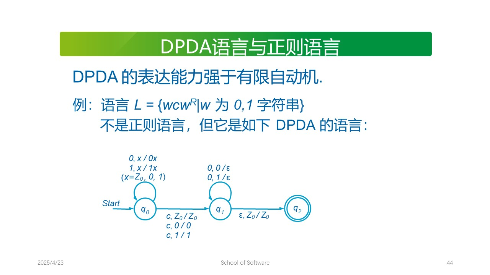
#### 三. 终态型DPDA与空栈型DPDA

+ 前缀性质：一个语言L具有前缀性质，当且仅当不存在$x,y\in L,x\ne y$，且$x$为$y$的前缀
+ 定理：语言L是空栈型DPDA P的语言，当且仅当
  + L具有前缀性质
  + L是终态型DPDA P'语言，即L=L(P')
$$
\{空栈型DPDA的语言\} \subset \{终态型DPDA的语言\} \quad (真包含)
$$

空栈型DPDA与正则语言没有关系。
#### 四. DPDA与二义文法

+ 定理：若语言L是终态型DPDA P的语言，则存在无二义上下文无关文法G，使得$L=L(G)$。也就是说终态型/空栈型DPDA的语言是无固有二义的。
$$
\{DPDA语言\} \subset \{CFG非固有二义语言\} （真包含）
$$

#### 五. CFG化简与规范-消去无用符号

^8d26bc

+ 相关定义

  + 有用符号：对于CFG $G=(V,T,S,P)$。称符号$X\in V\cup T$是有用的，当且仅当$S\Rightarrow^*\alpha X\beta\Rightarrow^* w$，其中$w\in T^*,\alpha,\beta\in(V\cup T)^*$
  + 无用符号：非有用符号
  + 无用产生式：含有无用符号的产生式
  + 产生符号：X称为产生符，如果存在$w\in T^*$，满足$X\Rightarrow^*w$。终结符是产生符
  + 可达符号：X称为产生符，如果存在$\alpha,\beta\in (V\cup T)^*$，满足$S\Rightarrow^*\alpha X\beta$。S是可达符
  + 有用符号一定是产生符号和可达符号，但是**反之不一定成立**。

+ 产生符算法

  对 $CFG~~G=(V,T,S,P)$，产生符集合由以下步骤计算：
  基础：任何终结符 $a\in T$都是产生符
  归纳：若有产生式$A\rightarrow \alpha$，且$\alpha \in (V\cup T)^*$中的**每个符号都是产生符**，则A也是产生符
  定理：此算法恰好求得$G$中所有的产生符

+ 可达符算法

  对 $CFG~~G=(V,T,S,P)$，可达符集合由以下步骤计算：
  基础：$S$是可达符
  归纳：若$A$是可达符，且$A\rightarrow \alpha$且$\alpha \in (V\cup T)^*$，则$\alpha$中的**每个符号都是可达符**
  定理：此算法恰好求得$G$中所有的可达符

+ 消去无用符号

  设 CFG $G=(V,T,S,P)，L(G)\ne \varnothing$

  + 消去非产生符号
    从G中删除所有非产生符以及所有**包含**这些符号的产生式，得到CFG $G_2=(V_2,T_2,S,P_2)$
  + 消去不可达符号
    从$G_2$中删除所有不可达符以及所有**包含**这些符号的产生式，得到 CFG $G_1=(V_1,T_1,S,P_1)$

+ 定理：**有上述算法得到的文法$G_1$不包含无用符号**，且$L(G_1)=L(G)$   **注意上面的两步消去是不可以交换顺序的**
  - 定理说明：剩余符号都是有用符号；新的文法与原来的文法是等价的
  - 证明思路：一方面，$G_1$中不包含无用符号；另一方面，对任何$w$，$S\Rightarrow^*_{G_1} w  ~~~iff S \Rightarrow^*_G w$

**消去无用符号的步骤**：
  + 计算产生符号集合
  + 消去非产生符号
  + 计算可达符号集合
  + 消去不可达符号

#### 六. 消去$\varepsilon$产生式

目的：方便文法的设计，利于文法规范化
消去$\varepsilon$产生式，除文法不能产生串$\varepsilon$外，不会影响到原文法相应的语言中其它字符串的产生。

+ 可空符号
  设 CFG $G=(V,T,S,P)$，称符号$A\in V$是可空的，如果$A\Rightarrow^*\varepsilon$
​	消去 $\varepsilon$ 产生式及其影响，需要计算可空符号的集合。

+ 可空符号集合计算步骤

  基础：对所有产生式$A\rightarrow \varepsilon$，$A$是一个可空符号
  归纳：如果有产生式$B\rightarrow C_1C_2\dots C_k$，其中**每一个**$C_i\in V$是可空符号，则$B$也是可空符号
+ 消去$\varepsilon$产生式算法

  + 计算$G$的可空符号集合
  + 对每一产生式 $A\rightarrow A_1A_2\dots A_k$
  + 在$G_1$中不包含$G$的所有$\varepsilon$产生式：$A\rightarrow \varepsilon$

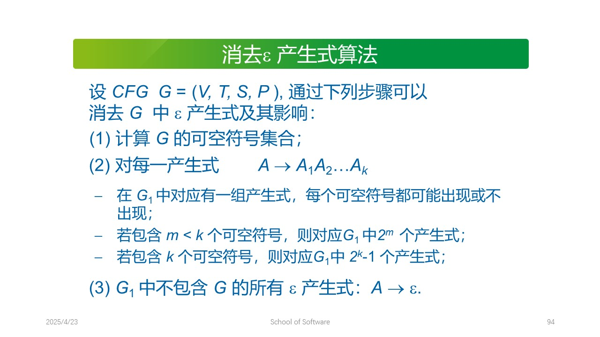
$$
L(G_1) = L(G) - \{\varepsilon\}
$$
例子：
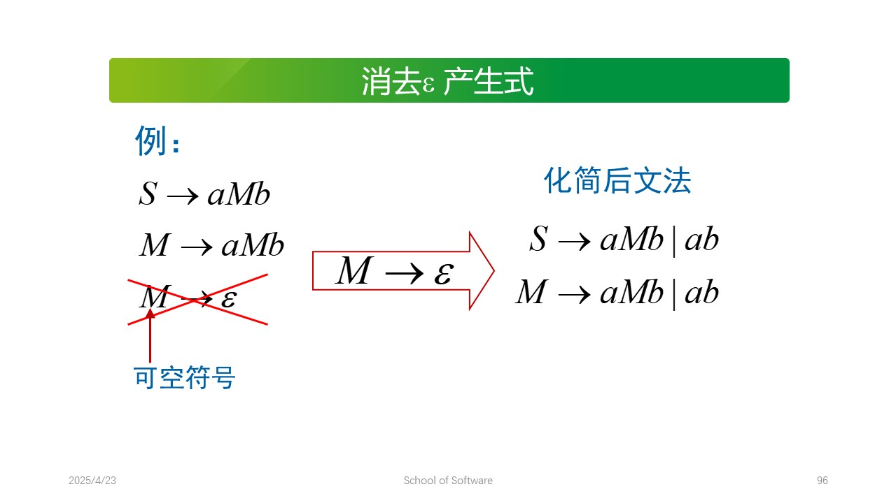

#### 七. 消去单一产生式

+ 单一产生式：形如$A\rightarrow B$的产生式，其中$A、B$为非终结符
+ 消去目的：可减少文法的变量，简化文法推导，利于文法规范化
+ 单一偶对：设 CFG $G=(V,T,S,P),A,B\in V,(A,B)$称为单一偶对，**如果$A\Rightarrow^* B$且该推导过程仅使用单一产生式。**

  消去单一产生式时，需要计算所有单一偶对的集合。

+ 消去单一产生式算法：
  + 计算 G 中的单一偶对集合
  + 对每个单一偶对(A,B)，在$G_1$中加入产生式$A\rightarrow \alpha$，其中$B\rightarrow \alpha$为非单一产生式
  + $G_1$中包含$G$的所有非单一产生式
  + 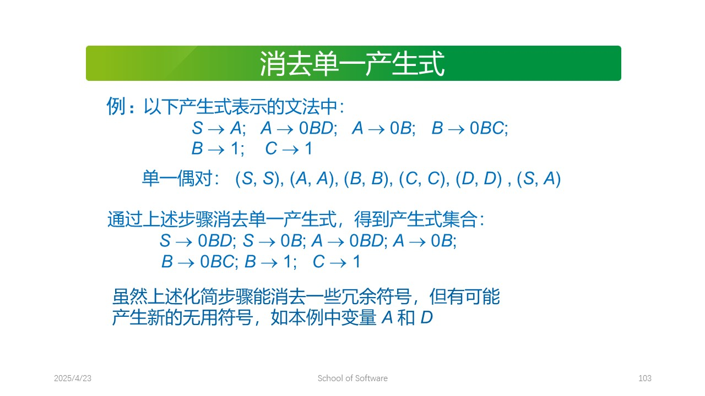
#### 八. CFG的化简和Chomsky范式

+ 简化步骤

  + 消去$\varepsilon-$产生式
  + 消去单一产生式
  + 消去无用产生式
	  + 计算并消去非产生符
	  + 计算并消去非可达符

+ Chomsky范式的条件

  + G中不含无用符号
  + 产生式P只有具有如下两种简单形式之一：$A\rightarrow BC$ 或 $A\rightarrow a$

+ 步骤
  + 消去$\varepsilon-$产生式、消去单一产生式、消去无用产生式
  + a. 如果某一终结符a出现于某些**右部长度大于1的产生式**中，则引入一个新的非终止符如A，将a替换成A，并新增$A\rightarrow a$
  + b. 右部长度>2的产生式$A\rightarrow B_1B_2\dots B_k$采用级联的方式转换，引入k-2个非终结符$A\rightarrow B_1C_1$ ，$C_1\rightarrow B_2C_2$

---

## 第十一讲：上下文无关语言的性质

#### 一. CFL的必要条件
 (Z-Library).pdf#page=203&rect=10,362,459,397&color=yellow)

#### 二.CFL的泵引理

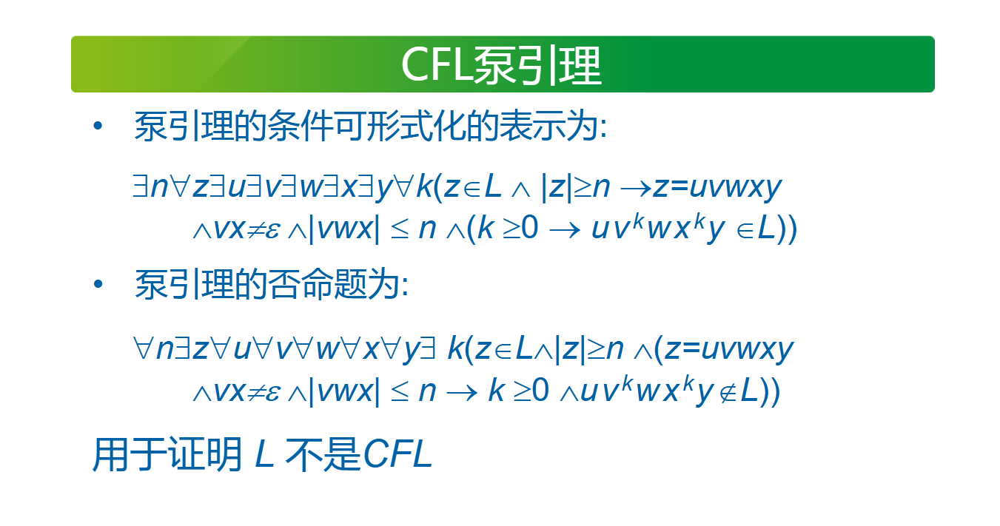
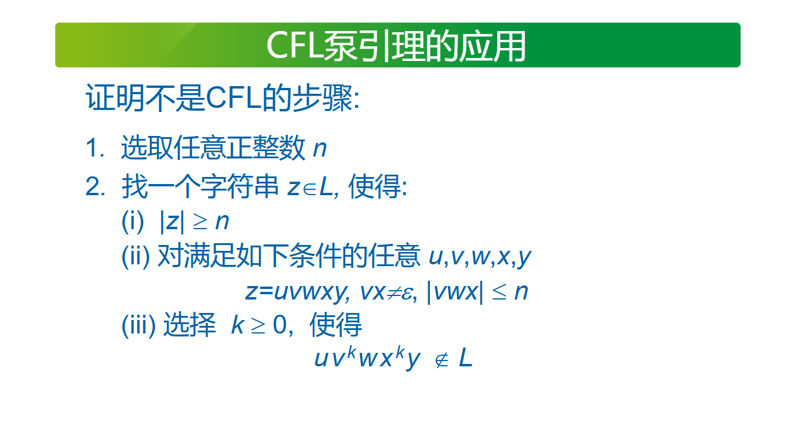
- 对任意的正整数
- 寻找一个字符串的长度大于等于n
- 对于任意的分割，存在一个k使得这个字符串不属于上面的语言

#### 三.CFL的闭运算性质

1. 并运算：如果$L$和$M$都是CFL，则$L\cup M$也是CFL
2. $*+$运算：如果$L$是CFL，那么$L^*$，$L^+$也是CFL
3. 连接运算：如果$L$和$M$是CFL，那么$LM$也是CFL
4. 反转运算：如果$L$是CFL，那么$L^R$也是CFL

对于上面性质的证明可以构造对应的CFG来证明新的语言是CFL

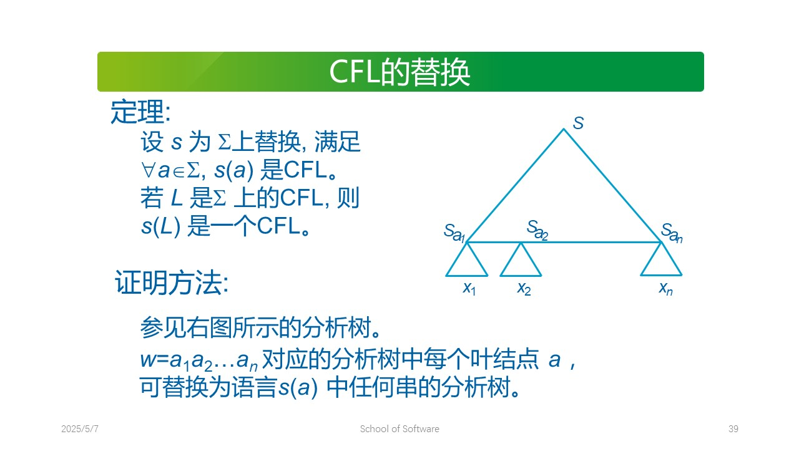
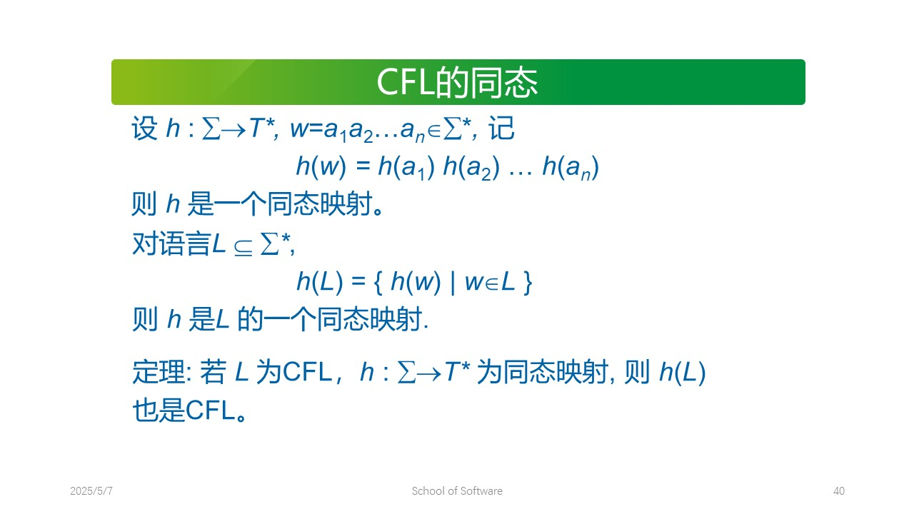
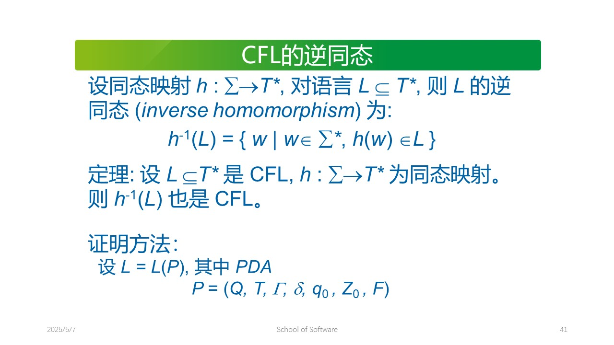
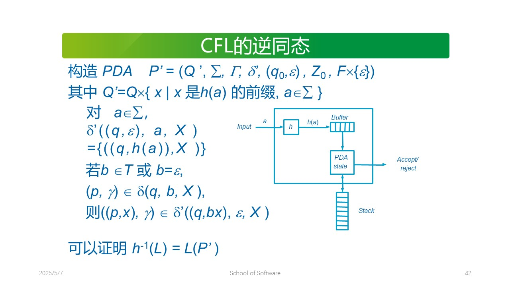

**注意上面介绍的同态和替换的定义并不相同，可以认为同态是替换的一种特例**。注意同态是将字符映射到字符串，而替换是将字符替换为语言。

对于CFL的交运算，CFL的交、补和差运算得到的都不一定是CFL

但是，**正则语言与CFL的交运算得到的一定是CFL**，可以使用对应的PDA和DFA来证明。[[第十一讲 - CFL的性质.pdf#page=48&selection=0,0,2,7|第十一讲 - CFL的性质, p.48]]
#### 四.CFL的判定问题

##### 空语言问题
检测CFG的开始变量是否无用即可

##### 无限语言问题
给定CFG $G$，判定$L(G)$是否无限，可以使用以下方法：
- 消去$\varepsilon$和单一产生式
- 消去无用符号
- 构造变量的依赖图
- 若变量依赖图有环，则$L(G)$无限，否则有限。
##### 语言元素问题-CYK算法

1. **输入**：
    - 文法 $G$（需为CNF形式，如 $A \to BC$ 或 $A \to a$）。
    - 字符串 $w = aabab$，长度 $n = 5$。
2. **初始化**：
    - 创建 $n \times n$ 表格，$dp[i][j]$ 表示子串 $w[i \ldots i+j-1]$ 能推导出的非终结符集合。
3. **填充长度为1的子串**：
    - 对每个 $i$，若 $w[i] = a$，根据规则（如 $A \to a$）填入 $dp[i][1]$。
4. **填充长度大于1的子串**：
    - 对于长度 $j = 2$ 到 $n$：
        - 对每个起始位置 $i = 1$ 到 $n-j+1$：
            - 分割子串 $w[i \ldots i+j-1]$ 为 $w[i \ldots k]$ 和 $w[k+1 \ldots i+j-1]$。
            - 检查规则 $X \to YZ$，若 $Y \in dp[i][k-i+1]$ 且 $Z \in dp[k+1][i+j-1-k]$，则 $X \in dp[i][j]$。
5. **结果判断**：
    - 若 $S \in dp[1][n]$，则 $w \in L(G)$.

##### 不可判定问题

## 第十二讲：Turning机（图灵机）		            
#### 一. 图灵机的介绍

+ 语言的层次：**图灵机接受的语言>上下无关语言>正则语言**
+ 基本图灵机：带（tape）、带头（tape head）、空白带符（blank）、单元格（cell）、带符（tape symbol）；读-写器（读头）、控制单元、两端无限
+ 每一步，读头都需要完成如下动作：读一个符号；写一个符号；左移或右移
+ 不容许有$\varepsilon$转移
+ 没有可能的转移，停机！
+ 接受输入：当TM能够到达某终态（**无论输入是否读完**、是否停机）
+ 拒绝输入：若TM停在一非终态或者若TM进入一无限循环

#### 二. 图灵机的定义

+ TM是七元组 $M=(Q,\Sigma,\Gamma,\delta,q_0,B,F)$
  有限状态集合；有限输入符号集；有限带符号集；转移函数；开始状态；空白符；终态集合
  例如：$M=(\{q_0,q_1,q_2,q_3,q_4,q_5,q_6\},\{0,1,2\},\{0,1,2,X,Y,Z,B\},\delta,q_0,B,\{q_6\})$转移函数会以图or表表示
+ 

#### 三. 图灵机的即时描述

+ TM即时描述ID
  图灵机：$M=(Q,\Sigma,\Gamma,\delta,q_0,B,F)$
  当前格局：$X_1X_2\dots X_{i-1}qX_{i}X_{i+1}\dots X_n$ 称为即时描述，或ID
  其中：$q\in Q$为当前M的状态；当前读头正在扫描$X_i$
  **对于两端无限长的B字符，在表示ID时不要写出。**

+ TM推导关系$\vdash$

  图灵机：$M=(Q,\Sigma,\Gamma,\delta,q_0,B,F)$
  定义ID‘s之间的推到关系 $\vdash_M$（或$\vdash$）如下：
  1. 设$\delta(q,X_i)=(p,Y,L)$，则有：
     $X_1X_2\dots X_{i-1}qX_iX_{i+1}\dots X_n ~~\vdash_M~~X_1X_2\dots X_{i-2}pX_{i-1}Y\dots X_n$
​		两个例外：
​			(1) i=1时， $qX_1X_2\dots X_{n}\vdash_{M} pBYX_2\dots X_n$
​			(2) i=n且Y=B时，$X_1X_2\dots X_{n-1}qX_n \vdash_M X_1X_2\dots X_{n-2}pX_{n-1}$
​	
2. 设$\delta(q,X_i)=(p,Y,R)$，则有：
​		$X_1X_2\dots X_{i-1}qX_iX_{i+1}\dots X_n ~~\vdash_M~~X_1X_2\dots X_{i-1}YpX_{i+1}\dots X_n$
​		两个例外：
​			(1) i=n时， $X_1X_2\dots X_{n-1}qX_{n}\vdash_{M} X_1X_2\dots X_{n-1}YpB$
​			(2) i=1且Y=B时，$qX_1X_2\dots X_n \vdash_M pX_2\dots X_{n-1}X_{n}$

#### 四. 图灵机的语言

+ 递归可枚举语言：图灵机接受的语言称为递归可枚举语言

  给定图灵机$M=(Q,\Sigma,\Gamma,\delta,q_0,B,F)$

  定义$M$的语言：$L(M)=\{w|w\in\Sigma^*,q_0w\vdash^*_M \alpha p\beta,p\in F,\alpha\in\Gamma^*,\beta \in \Gamma^+\}$

+ 停机：若TM没有可能的后续转移，则停机
+ 定理：任给图灵机 $M$，容易构造一个图灵机 $M'$ 使得 $L(M)=L(M')$ ，并满足：如果$w\in L(M)$则对于 $w$，$M'$接受$w$ 并一定停机。由此结论，如果没有特别指出，今后假定**图灵机到达终态后一定停机。**
  但是，若$w\notin L(M)$,则对于 $w$，$M$ 不一定能停机。

+ 递归语言：

  称语言$L$是递归的，当且仅当存在图灵机$M$，$L=L(M)$，且满足：

  1. 若$w\in L(M)$，则对于$w$，$M$接受$w$，自然会停机
  2. 若$w\notin L(M)$，则对于$w$，$M$最终也会停机

  递归语言对应的问题是可判定的。

#### 五. 图灵机的计算

+ 函数 $f$ 是可计算的，如果存在图灵机$M$，对任意的$w\in D$，满足：
  $f: q_0w\vdash^* q_ff(w)$
+ 选用单位制表示整数（即用1的个数来表示正整数）
##### 可计算函数的例子
- $f(x,y)= x+y$是可计算的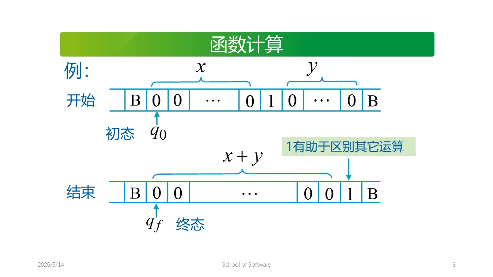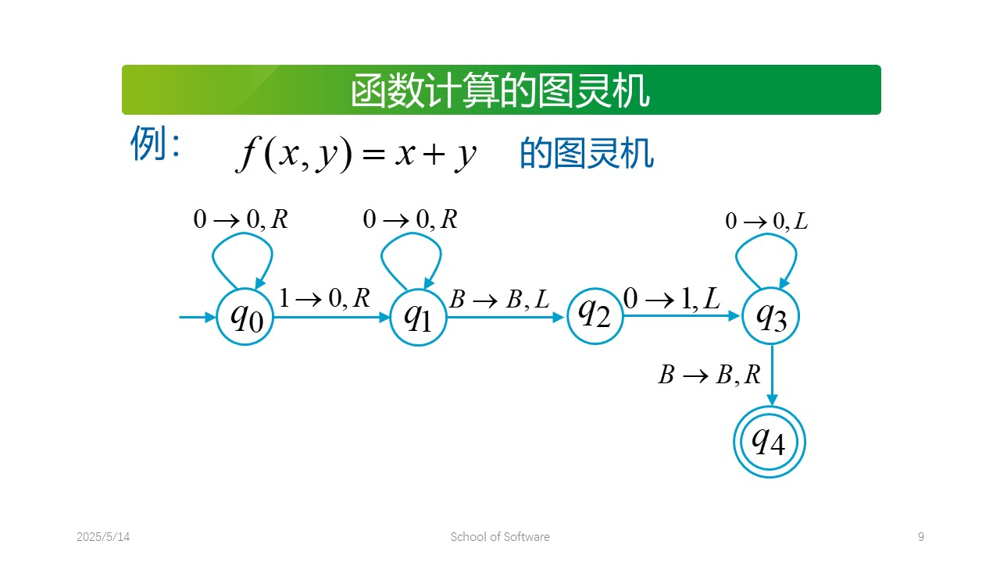
- $f(x)=2x$是可计算的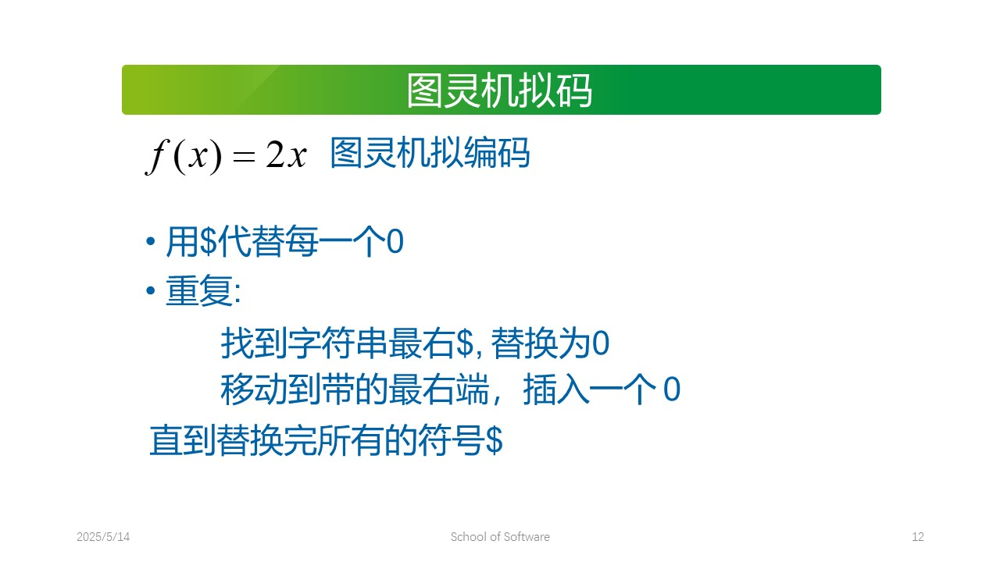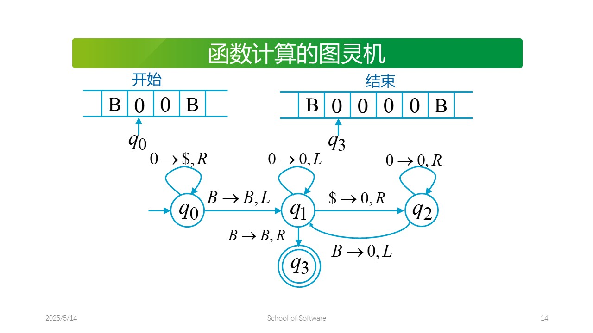
- $f(x,y)=\begin{cases} 1 &\text{if} \quad x>y \\ 0 &\text{if} \quad x\leq y\end{cases}$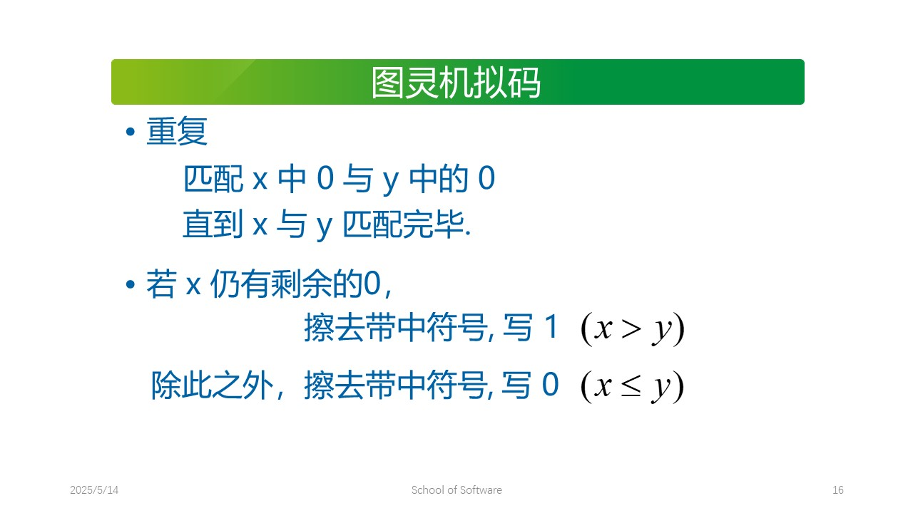
- $f(x)=x^2$是可以计算的
  考虑进行$x$次加法即可

#### 六. 图灵机的编程技巧

+ 带存储区的状态
  图灵机$M=(Q,\Sigma,\Gamma,\delta,q_0,B,F)$状态中可以包含一个具有有限个取值的存储单元，即状态集合为：
  $Q=S\times T=\{[q,a]|q\in S,a\in T\}$
  其中$q\in S$表示控制状态，$a\in T$表示数据元素

+ 多道图灵机
  此类图灵机 $M=(Q,\Sigma,\Gamma,\delta,q_0,B,F)$中，带符号是向量的形式。

- 图灵机的子程序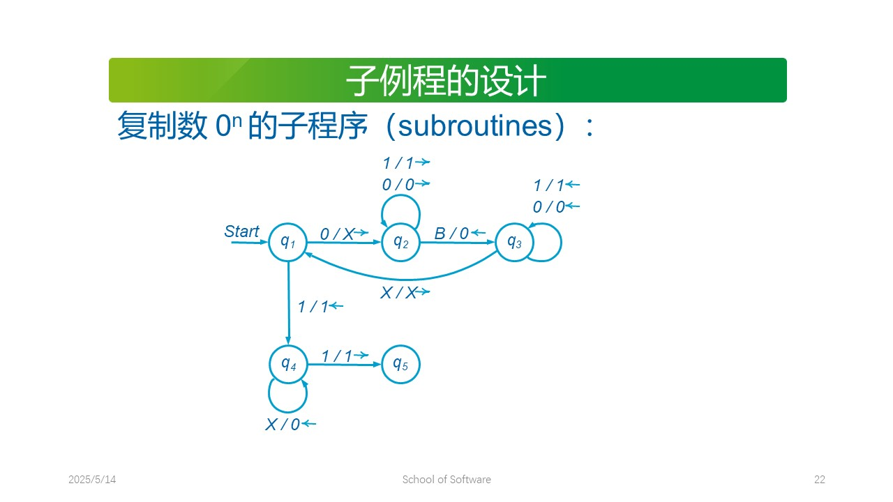
- 计算乘法的图灵机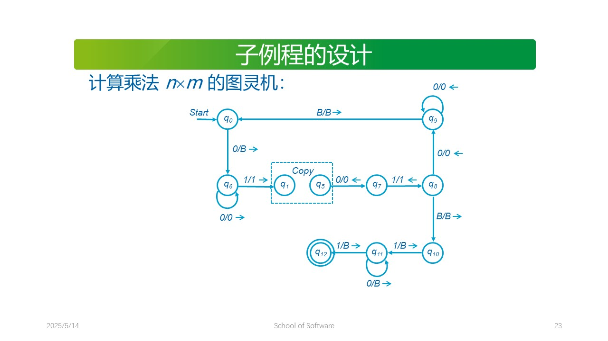
#### 七. 图灵理论

+ Turing观点：能机械计算的一定能用图灵机实现
+ 计算机科学理论：至今为止没有比图灵机更强的计算模型
+ 算法的定义：函数$f(w)$的算法，定义为计算$f(w)$的图灵机。【算法就是图灵机】
+ Computer Sience Law：一个计算是可被机器完成的，当且仅当它可以被一个图灵机完成。
+ **没有任何已知的计算模型，其计算能力比图灵机强**
+ 图灵机等价：图灵机$M_1$与图灵机$M_2$称为等价，如果$L(M_1)=L(M_2)$

#### 八. 图灵机的拓展

- 多通道图灵机
  多通道图灵机是一个读写头读写一个向量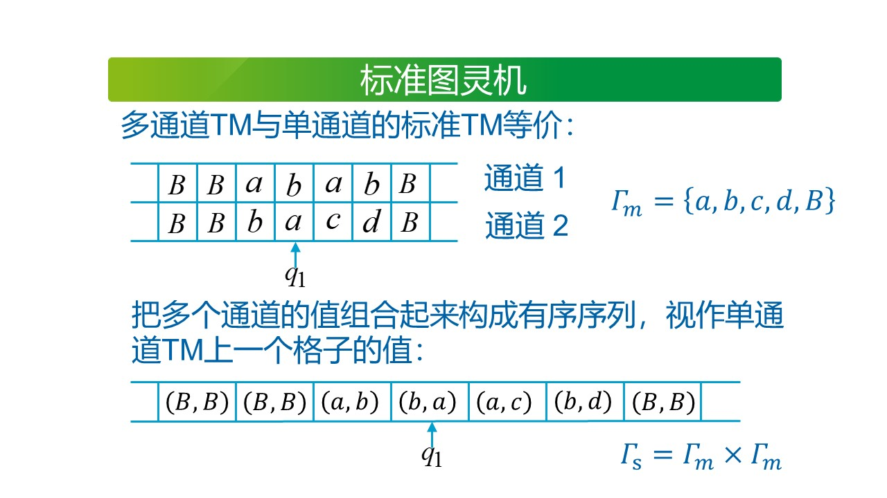
- 多带图灵机
	- 可以用多带图灵机来模拟多通道图灵机，也可以用多通道图灵机来模拟多带图灵机
	- 用多通道TM来模拟多带TM的方法为，对于每一个通道，使用两条带来模拟，其中一条保存当前读头的位置，另一个保存当前通道的内容
		- 将多带TM的每一个状态转移拆分为多带TM中的多个状态转移，分为先发现哪个通道的读头位置进行讨论
	- 多带图灵机与标准TM功能相同，但是二者速度会有差异
- 多维图灵机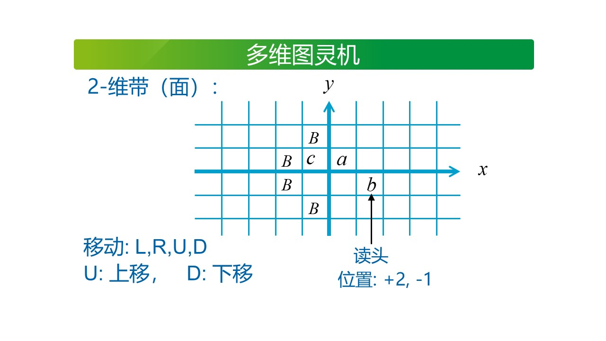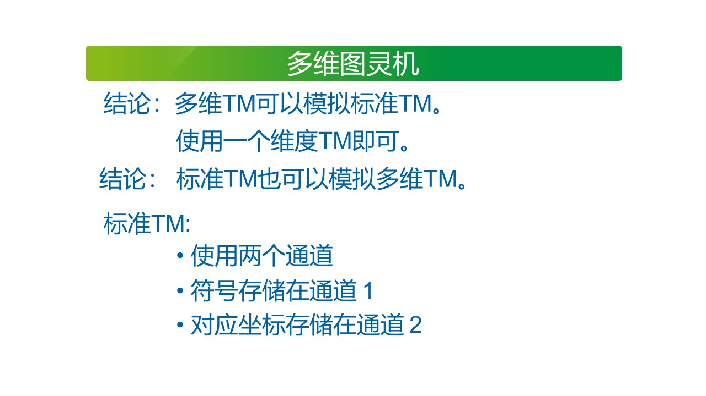

对于图灵机移动的拓展有：

- 增加具有停止功能的图灵机：
	- 停止功能的TM与标准TM的功能相同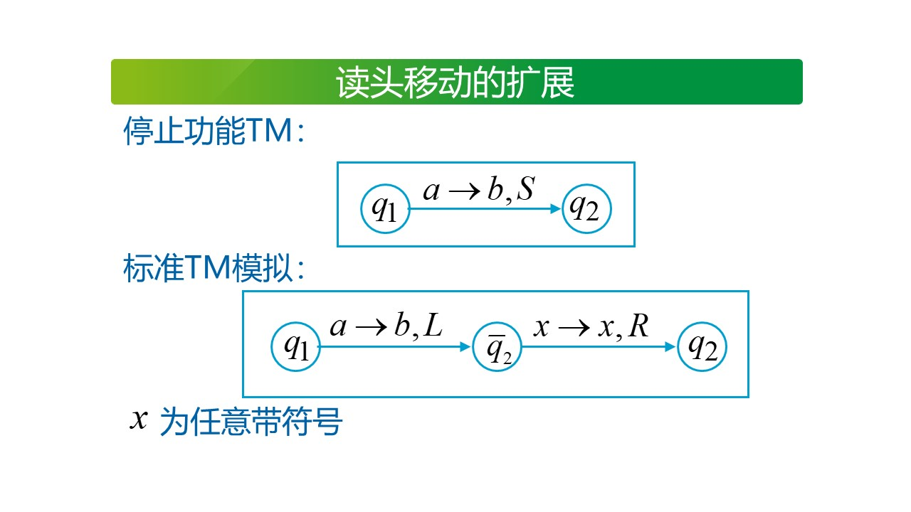
- 状态转移的拓展：非确定TM
	- 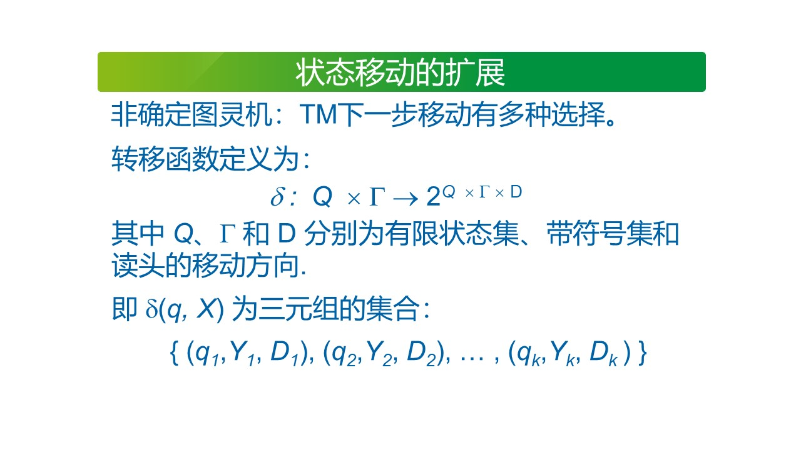
	- 非确定TM与标准TM功能相同，对于确定TM保存所有可能的计算路径并保存在二维带中。确定TM模拟非确定TM，复杂度在指数级
	- 使用的是**广度优先搜索（BFS）**
- 半无限带自动机
	- 用**两通道**半无限带自动机来模拟标准自动机，在状态中添加左状态和右状态
	- 半无限带自动机和标准TM功能相同
	- 对于原TM的任意状态添加左右情况下的转移，在跨越边界时，将左状态和右状态进行切换
- 
#### 九. 图灵机与其他自动机

- 多栈机
	- 多栈机和DPDA的区别在于使用多个堆栈，状态转移函数为
		$\delta(q,a,X_1\dots X_k)=(p,Y_1\dots Y_k)$
	- 可以使用多栈机来模拟标准TM，**一个双栈的PDA可以模拟标准TM**
	- 多栈自动机可以使用多带图灵机来模拟，其中使用一个栈来模拟带，对应带来模拟对应栈
	- 例：设计一个双栈PDA接受的语言$L=\{0^n1^n2^n | n\ge 1\}$，模拟图灵机运行即可
- 计数器机
	- 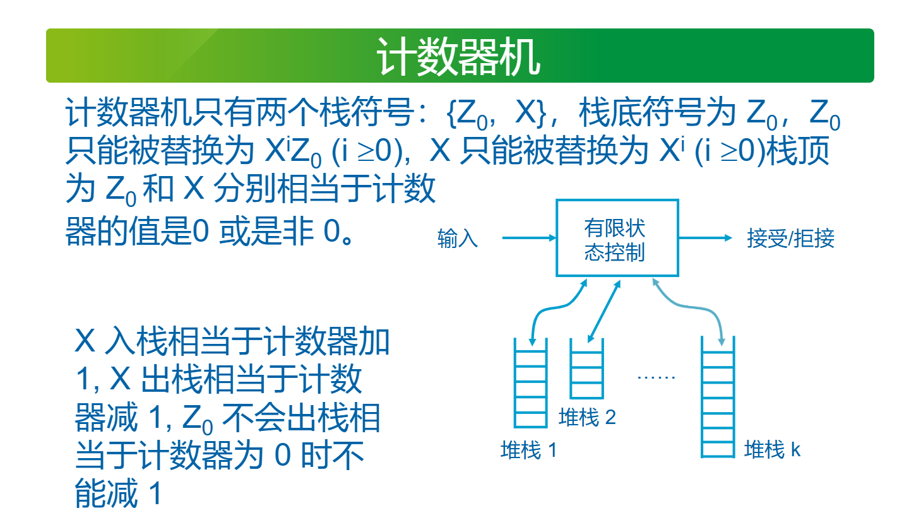
	- 可以证明：
		- 具有一个计数器的计数器机的语言接受能力相当于DPDA
		- 有两个或以上计数器的计数器机语言接受能力相当于图灵机
			- 任何递归可枚举语言可以被具有三个计数器的计数器机接受
			- 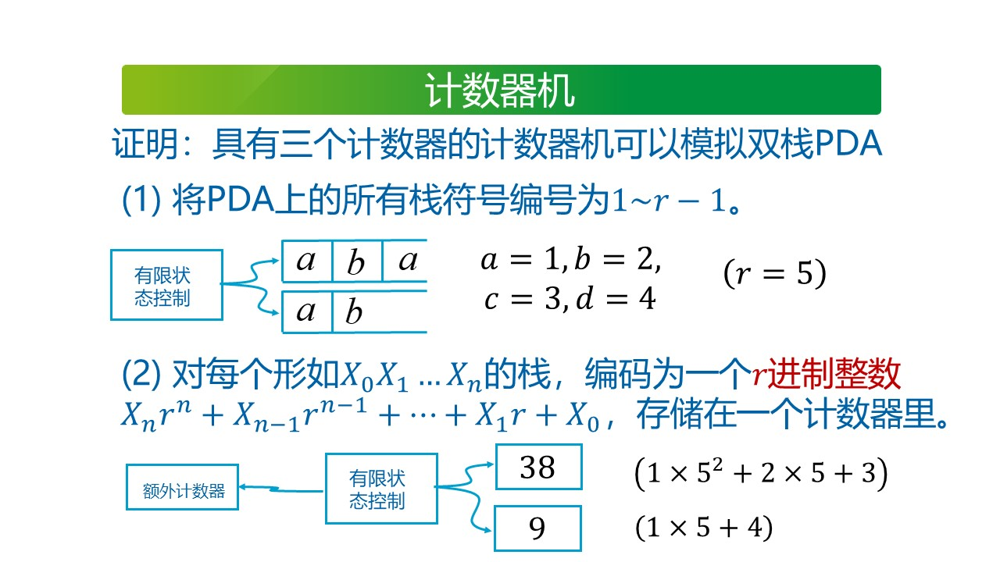其中$X_0$为栈顶
			- 
			- 有三个计数器的计数器机可以用具有两个计数器的计数器机来模拟
			- 将三个计数器上的数表示在一个计数器中，表示方法用三个质数的乘方
- 现代计算机
	- 现代计算机能模拟图灵机
	- 图灵机能模拟现代计算机
## 第十三讲：不可判定问题

#### 一、图灵机的编码

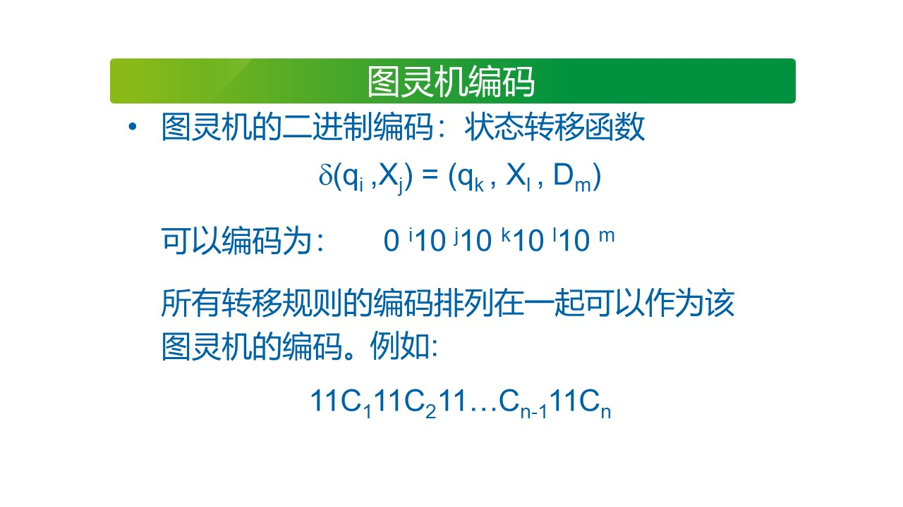

对于一个图灵机可以使用多种方式进行编码。编码对应的二进制串采用$1w$编码，即在**输入字符串**前面加上一个$1$，用编码的字符串$1w$来计算是第几个字符串。

#### 二、对角线语言与通用语言

- 不是每一个正整数$j$都能对应一个图灵机，如果整数$j$没有对应的图灵机，那么认为第$j$个图灵机不接受任何字符串。
- **对角线语言**：设$M_i$为第$i$个图灵机
	$L_d=\{w_i|M_i\text{不接受} w_i\}$
- **对角线语言不是递归可枚举语言**，可以用反证法证明上面语言不会被任何一个图灵机接受，类似于理发师悖论
	- 如果有图灵机$M$能接受这个语言，那么将这个图灵机的编码$w$进行输入，如果$M$接受，那么$w$就不在$L_d$中；如果$M$不接受，那么$w$就在$L_d$中。
	- 但是上面的语言是客观存在的

- **通用语言**：$L_u=\{(M,w)|M\text{接受} w\}$
	- $M$的二进制编码为$C$，$w$为$(0+1)^*$中的串$C'$，$(M,w)$的二进制编码为$C111C'$
	- 上面描述的是哪些图灵机和被接受的输入串的组合构成的语言
	- **通用语言是递归可枚举语言**

#### 三、递归语言的性质

- 递归可枚举语言：存在一个接受语言的图灵机
	- 在该语言中的串，一定能让图灵机停机并接受
	- 不在该语言中的串，可能让图灵机停机并拒绝，也有可能让图灵机无法停机
- 递归语言：存在一个接受语言的图灵机
	- 在该语言中的串，一定能让图灵机停机并接受
	- 不在该语言中的串，**一定**让图灵机停机并拒绝
- $\{递归语言 \subset 递归可枚举语言\}$

- **若$L$是递归语言，则$\overline{L}$也是递归语言**
  [[第十四讲 - 不可判定问题、自动机的应用.pdf#page=9|第十四讲 - 不可判定问题、自动机的应用, p.9]]
	- **通用语言**$L_u$是**递归可枚举语言，但不是递归语言**。$\overline{L_u}$不是递归可枚举语言
	  否则可以将对角线语言对应的问题归约到$\overline{L_u}$对应的问题，即$L_d$是递归可枚举语言
- **若语言$L$和$\overline{L}$都是递归可枚举语言，那么$L$和$\overline{L}$都是递归语言**
  [[第十四讲 - 不可判定问题、自动机的应用.pdf#page=11|第十四讲 - 不可判定问题、自动机的应用, p.11]]

#### 四、判定问题与语言

- 判定问题：给定一个语言$L$，对于任意给定的字符串$w$，判定$w\in L$是否成立
- 性质：任意输入到$true$或$false$的映射
- 问题对应的语言：$L_p= \{x | P(x) ==true\}$
- **问题的判定**：
	-  若一个问题对应的语言是**递归语言**，则称该问题是可判定的，否则是不可判定的
	- 若一个问题对应的语言是**递归可枚举语言**，则称该问题是部分可判定的
- 问题的归约
	- 设$P_1$和$P_2$是两个问题，$P_1$归约到$P_2$，如果存在一个多项式时间的算法将$P_1$的实例转化为$P_2$的实例
	- 如果问题$P_2$是可判定的，那么问题$P_1$也是可判定的
	- 如果问题$P_2$是部分可判定的，那么问题$P_1$也是部分可判定的
	- 如果问题$P_1$是不可判定的，那么$P_2$也是不可判定的
	- 如果问题$P_1$不是部分可判定的，那么$P_2$也是非部分可判定的
- 图灵机语言非空问题：
	- 对应语言$L_{ne}=\{M|L(M)\ne \varnothing\}$
	- $L_{ne}$是**递归可枚举语言**，但不是递归语言
		- 可以借助$L_u$对应的图灵机$M'$构造，将图灵机编码$M$输入，并且枚举所有的字符串$w$，如果$M'$接受，则说明$L(M)$非空，这时候接受并停机。否则上述图灵机不可能停机，于是拒绝。
		- 这样可以证明$L_{ne}$是递归可枚举语言
		- 设计一个转换算法$f$，将任何$(M,w)\in L_u \Leftrightarrow M' \in L_{ne}$
			- 忽略输入$x$，只将它当作启动信号
			- 内部模拟原图灵机$M$在输入$w$上的运行。
			- 如果$M$接受$w$，那么$M'$接受$x$。
			- 否则，$M'$拒绝或不停止。
	- $L_e = \overline{L_{ne}}$**不是递归可枚举语言**，否则$L_{ne}$是递归语言
- 图灵停机问题是不可判定的
- 平凡性质与非平凡性质：
	- 在$X$上的性质$P$，如果性质对应的集合是**空集或全集**，那么称之为平凡性质
- **Rice定理：递归可枚举语言的每一个非平凡性质都是不可判定的** ^52defa
	- 指的是**满足性质P的所有语言构成的集合**不可判定，或其对应的问题：任给一个**语言**、它满足性质P吗？的问题不可判定。
	- 归约的过程为，将$L_u$的实例归约到图灵机接受的语言是否满足性质$P'$。只需要从输入$(M,w)$构造$M'$即可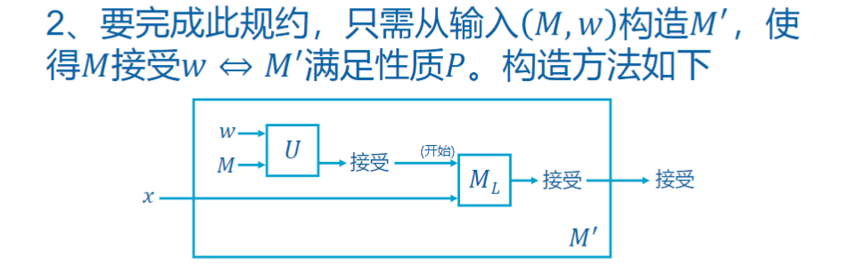 
- Post对应问题：
	- 从两个长度相同的列表中选择相同顺序的项，拼接后是否能得到两个完全相同的字符串？
	  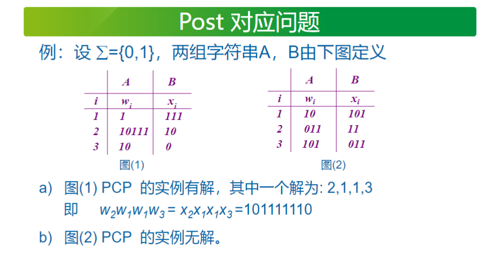
	- Post对应问题是不可判定的
	- [[This semester/Formal Language and Automata/自动机理论 语言和计算导论 原书第3版·典藏版 (约翰·E. 霍普克罗夫特,拉杰夫·莫特瓦尼,杰弗里·D.乌尔曼) (Z-Library).pdf#page=285|自动机理论 语言和计算导论 原书第3版·典藏版 (约翰·E. 霍普克罗夫特,拉杰夫·莫特瓦尼,杰弗里·D.乌尔曼) (Z-Library), p.273]]
	- 

