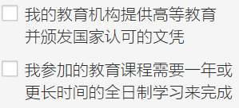
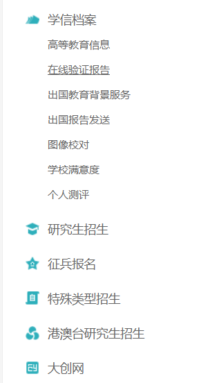

# JetBrains 学生认证申请指北

> 作者：liukuan22@mails.tsinghua.edu.cn  
> 如有**错漏字**可自行修改，如有**方法失效**或**其他问题**可联系我或评论留言或提交 [issues](https://github.com/WeYoung-learn/WeYoung-learn.github.io/issues/new)

[PDF 文档](../pdf/skills/JetBrains学生认证申请指北.pdf)

## Step 1

打开：https://www.jetbrains.com.cn/community/education/#students/ （中文界面） 或者：https://www.jetbrains.com/community/education/#students/ （英文界面）

下拉页面，点击 `立即申请`/`Apply now`，跳转到申请界面

或点击 （https://www.jetbrains.com/shop/eform/students） 直接跳转到申请界面

> **请注意：申请全过程请勿使用代理网络或伪装网络。**

## Step 2

申请界面共有四种申请方式：

- UNIVERSITY EMAIL ADDRESS - 大学邮件地址
- ISIC/ITIC MEMBERSHIP - ISIC/ITIC 成员
- OFFICIAL DOCUMENT - 官方文件
- GITHUB - GitHub

> 由于 `.edn.cn` 后缀不会被识别为教育网站 (`.edu` 后缀)，故此，第一种方法暂不可用，而大部分学生也不具有国际学生证~~（当然你也可以交 80 CNY 申请）~~，因此第二种方法也暂不选，而第四种通过 GitHub 授权的方法也只适用与在 Github 上通过学生认证的群体，因此，本文会主要介绍第三种零成本的方法。

在页面中选择第三种申请方式 `官方文件`/`OFFICIAL DOCUMENT`，依次填入选项。 **请注意**：

- 电子邮件地址应输入**学校的电子邮件地址**
- 姓名请输入**中文**，并与 **学籍/身份证** 上的姓名一样
- 出生日期同理，请填入与 **学籍/身份证** 上一样的出生日期
- 学术机构名称即填入学校名称（请使用**全称**，如在英文界面提交申请最好附上英文）
- 学术机构网站即输入学校官网即可
- 注意如实勾选教育机构和自身学年状态 
- 在提交的官方文件中附上自己的学生证照片/录取通知书照片/学籍照片/学信网的学校状态验证报告（即任何证明与所属的学术机构有附属关系的**正式文件**）
  - 对于所学专业与计算机无关的学生群体，在提交时**请额外提交自己修选计算机相关课程的证明**（如课表，成绩，乃至学位证明），或**相关竞赛证明**（参加计算机相关竞赛的获奖证明），或是**参加相关学术研究的证明**（参与到计算机相关学术研究的证明），补充材料的档案内容必须包含姓名、编程相关内容、日期、等等。

- 添加学信网报告在线验证码时，请**确保有效期至少大于三天时间**（建议一周以上的有效时间） 获取学信网报告在线验证码流程：
  - 注册/登陆学信网（https://www.chsi.com.cn/），并完成个人信息的填写
  - 在 `账号管理` 界面的右侧找到`学信档案` - `在线验证报告`，点击进入 
  - `查看` 教育部学籍在线验证报告，如没有报告，点击申请即可获得30天有效期的报告验证码；如已有报告，注意检查报告的有效期，如有效期过短可点击 `延长验证有效期`

- 备注栏可添加的内容（对于所修非计算机相关学生，**建议填写**）：
  - 自己的 GitHub、Atcoder 等等的账号
  - 自己使用编程的想法与目的

- 如实勾选最后的选项

完成申请表内容后，Then 点击 `申请免费产品`/`APPLY FOR FREE PRODUCT` 即可

## Step 3

由于提交官方文件需要真人审理，周期较长（三天-两周），注意检查邮箱并等待即可，如回复需要进一步补充材料，按步骤进行即可。

已有 ISIC/ITIC 的学生或已在 Github 上通过学生认证的学生，可以选择第二种和第四种方法，同样，按步骤来就行。

## End

收到 Jetbrains 证实学生信息的说明后，按步骤绑定已有账号或新建账号即可使用专业版。

Then, enjoy it!
